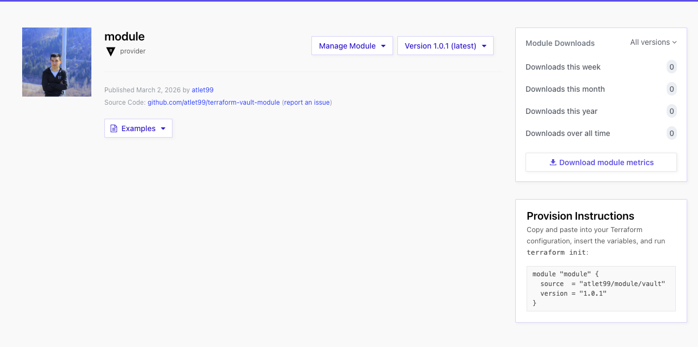

# terraform-vault-module

Reusable Terraform module for managing HashiCorp Vault resources: secrets engines, auth backends, policies, audit devices, Kubernetes auth, KV-V2 secrets, namespaces (Enterprise), and generic endpoints.

All resource types are driven by `map(object(...))` variables. Pass an empty map (default) to skip any resource type.

## Requirements

| Name      | Version   |
| --------- | --------- |
| terraform | >= 1.11.0 |
| vault     | ~> 5.7.0  |



## Usage

```hcl
module "vault" {
  source = "github.com/atlet99/terraform-vault-module"

  mounts = {
    kv = {
      path    = "secret"
      type    = "kv"
      options = { version = "2" }
    }
    transit = {
      path = "transit"
      type = "transit"
    }
  }

  auth_backends = {
    approle = {
      type = "approle"
    }
  }

  policies = {
    dev = {
      name   = "dev-team"
      policy = <<-EOT
        path "secret/data/dev/*" {
          capabilities = ["create", "read", "update", "list"]
        }
      EOT
    }
  }

  kubernetes_auth_backends = {
    primary = {
      kubernetes_host = "https://kubernetes.default.svc"
      roles = {
        app = {
          role_name                        = "app"
          bound_service_account_names      = ["app-sa"]
          bound_service_account_namespaces = ["default"]
          token_policies                   = ["dev-team"]
          token_ttl                        = 3600
        }
      }
    }
  }

  audit_devices = {
    file = {
      type    = "file"
      options = { file_path = "/vault/logs/audit.log" }
    }
  }

  # -- Identity Management -----------------------------------------------------

  identity_entities = {
    john_doe = {
      name     = "john-doe"
      metadata = { team = "platform" }
      policies = ["dev-team"]
    }
  }

  identity_groups = {
    dev_leads = {
      name     = "dev-leads"
      policies = ["admin"]
    }
  }
}
```

<!-- BEGIN_TF_DOCS -->
## Requirements

| Name | Version |
|------|---------|
| <a name="requirement_terraform"></a> [terraform](#requirement\_terraform) | >= 1.10.0 |
| <a name="requirement_vault"></a> [vault](#requirement\_vault) | ~> 5.7.0 |

## Providers

| Name | Version |
|------|---------|
| <a name="provider_vault"></a> [vault](#provider\_vault) | 5.7.0 |

## Resources

| Name | Type |
|------|------|
| [vault_alicloud_auth_backend_role.this](https://registry.terraform.io/providers/hashicorp/vault/latest/docs/resources/alicloud_auth_backend_role) | resource |
| [vault_approle_auth_backend_role.this](https://registry.terraform.io/providers/hashicorp/vault/latest/docs/resources/approle_auth_backend_role) | resource |
| [vault_audit.this](https://registry.terraform.io/providers/hashicorp/vault/latest/docs/resources/audit) | resource |
| [vault_audit_request_header.this](https://registry.terraform.io/providers/hashicorp/vault/latest/docs/resources/audit_request_header) | resource |
| [vault_auth_backend.alicloud](https://registry.terraform.io/providers/hashicorp/vault/latest/docs/resources/auth_backend) | resource |
| [vault_auth_backend.aws](https://registry.terraform.io/providers/hashicorp/vault/latest/docs/resources/auth_backend) | resource |
| [vault_auth_backend.azure](https://registry.terraform.io/providers/hashicorp/vault/latest/docs/resources/auth_backend) | resource |
| [vault_auth_backend.cert](https://registry.terraform.io/providers/hashicorp/vault/latest/docs/resources/auth_backend) | resource |
| [vault_auth_backend.kubernetes](https://registry.terraform.io/providers/hashicorp/vault/latest/docs/resources/auth_backend) | resource |
| [vault_auth_backend.oci](https://registry.terraform.io/providers/hashicorp/vault/latest/docs/resources/auth_backend) | resource |
| [vault_auth_backend.spiffe](https://registry.terraform.io/providers/hashicorp/vault/latest/docs/resources/auth_backend) | resource |
| [vault_auth_backend.this](https://registry.terraform.io/providers/hashicorp/vault/latest/docs/resources/auth_backend) | resource |
| [vault_aws_auth_backend_client.this](https://registry.terraform.io/providers/hashicorp/vault/latest/docs/resources/aws_auth_backend_client) | resource |
| [vault_aws_auth_backend_role.this](https://registry.terraform.io/providers/hashicorp/vault/latest/docs/resources/aws_auth_backend_role) | resource |
| [vault_aws_secret_backend_role.this](https://registry.terraform.io/providers/hashicorp/vault/latest/docs/resources/aws_secret_backend_role) | resource |
| [vault_aws_secret_backend_static_role.this](https://registry.terraform.io/providers/hashicorp/vault/latest/docs/resources/aws_secret_backend_static_role) | resource |
| [vault_azure_auth_backend_config.this](https://registry.terraform.io/providers/hashicorp/vault/latest/docs/resources/azure_auth_backend_config) | resource |
| [vault_azure_auth_backend_role.this](https://registry.terraform.io/providers/hashicorp/vault/latest/docs/resources/azure_auth_backend_role) | resource |
| [vault_azure_secret_backend.this](https://registry.terraform.io/providers/hashicorp/vault/latest/docs/resources/azure_secret_backend) | resource |
| [vault_azure_secret_backend_role.this](https://registry.terraform.io/providers/hashicorp/vault/latest/docs/resources/azure_secret_backend_role) | resource |
| [vault_azure_secret_backend_static_role.this](https://registry.terraform.io/providers/hashicorp/vault/latest/docs/resources/azure_secret_backend_static_role) | resource |
| [vault_cert_auth_backend_role.this](https://registry.terraform.io/providers/hashicorp/vault/latest/docs/resources/cert_auth_backend_role) | resource |
| [vault_consul_secret_backend.this](https://registry.terraform.io/providers/hashicorp/vault/latest/docs/resources/consul_secret_backend) | resource |
| [vault_consul_secret_backend_role.this](https://registry.terraform.io/providers/hashicorp/vault/latest/docs/resources/consul_secret_backend_role) | resource |
| [vault_database_secret_backend_connection.this](https://registry.terraform.io/providers/hashicorp/vault/latest/docs/resources/database_secret_backend_connection) | resource |
| [vault_database_secret_backend_role.this](https://registry.terraform.io/providers/hashicorp/vault/latest/docs/resources/database_secret_backend_role) | resource |
| [vault_database_secret_backend_static_role.this](https://registry.terraform.io/providers/hashicorp/vault/latest/docs/resources/database_secret_backend_static_role) | resource |
| [vault_egp_policy.this](https://registry.terraform.io/providers/hashicorp/vault/latest/docs/resources/egp_policy) | resource |
| [vault_gcp_auth_backend.this](https://registry.terraform.io/providers/hashicorp/vault/latest/docs/resources/gcp_auth_backend) | resource |
| [vault_gcp_auth_backend_role.this](https://registry.terraform.io/providers/hashicorp/vault/latest/docs/resources/gcp_auth_backend_role) | resource |
| [vault_gcp_secret_backend.this](https://registry.terraform.io/providers/hashicorp/vault/latest/docs/resources/gcp_secret_backend) | resource |
| [vault_gcp_secret_roleset.this](https://registry.terraform.io/providers/hashicorp/vault/latest/docs/resources/gcp_secret_roleset) | resource |
| [vault_gcp_secret_static_account.this](https://registry.terraform.io/providers/hashicorp/vault/latest/docs/resources/gcp_secret_static_account) | resource |
| [vault_generic_endpoint.this](https://registry.terraform.io/providers/hashicorp/vault/latest/docs/resources/generic_endpoint) | resource |
| [vault_github_auth_backend.this](https://registry.terraform.io/providers/hashicorp/vault/latest/docs/resources/github_auth_backend) | resource |
| [vault_identity_entity.this](https://registry.terraform.io/providers/hashicorp/vault/latest/docs/resources/identity_entity) | resource |
| [vault_identity_entity_alias.this](https://registry.terraform.io/providers/hashicorp/vault/latest/docs/resources/identity_entity_alias) | resource |
| [vault_identity_entity_policies.this](https://registry.terraform.io/providers/hashicorp/vault/latest/docs/resources/identity_entity_policies) | resource |
| [vault_identity_group.this](https://registry.terraform.io/providers/hashicorp/vault/latest/docs/resources/identity_group) | resource |
| [vault_identity_group_alias.this](https://registry.terraform.io/providers/hashicorp/vault/latest/docs/resources/identity_group_alias) | resource |
| [vault_identity_group_member_entity_ids.this](https://registry.terraform.io/providers/hashicorp/vault/latest/docs/resources/identity_group_member_entity_ids) | resource |
| [vault_identity_group_member_group_ids.this](https://registry.terraform.io/providers/hashicorp/vault/latest/docs/resources/identity_group_member_group_ids) | resource |
| [vault_identity_group_policies.this](https://registry.terraform.io/providers/hashicorp/vault/latest/docs/resources/identity_group_policies) | resource |
| [vault_identity_mfa_login_enforcement.this](https://registry.terraform.io/providers/hashicorp/vault/latest/docs/resources/identity_mfa_login_enforcement) | resource |
| [vault_identity_mfa_totp.this](https://registry.terraform.io/providers/hashicorp/vault/latest/docs/resources/identity_mfa_totp) | resource |
| [vault_identity_oidc_assignment.this](https://registry.terraform.io/providers/hashicorp/vault/latest/docs/resources/identity_oidc_assignment) | resource |
| [vault_identity_oidc_client.this](https://registry.terraform.io/providers/hashicorp/vault/latest/docs/resources/identity_oidc_client) | resource |
| [vault_identity_oidc_key.this](https://registry.terraform.io/providers/hashicorp/vault/latest/docs/resources/identity_oidc_key) | resource |
| [vault_identity_oidc_provider.this](https://registry.terraform.io/providers/hashicorp/vault/latest/docs/resources/identity_oidc_provider) | resource |
| [vault_identity_oidc_role.this](https://registry.terraform.io/providers/hashicorp/vault/latest/docs/resources/identity_oidc_role) | resource |
| [vault_identity_oidc_scope.this](https://registry.terraform.io/providers/hashicorp/vault/latest/docs/resources/identity_oidc_scope) | resource |
| [vault_jwt_auth_backend_role.this](https://registry.terraform.io/providers/hashicorp/vault/latest/docs/resources/jwt_auth_backend_role) | resource |
| [vault_kmip_secret_backend.this](https://registry.terraform.io/providers/hashicorp/vault/latest/docs/resources/kmip_secret_backend) | resource |
| [vault_kmip_secret_role.this](https://registry.terraform.io/providers/hashicorp/vault/latest/docs/resources/kmip_secret_role) | resource |
| [vault_kmip_secret_scope.this](https://registry.terraform.io/providers/hashicorp/vault/latest/docs/resources/kmip_secret_scope) | resource |
| [vault_kubernetes_auth_backend_config.this](https://registry.terraform.io/providers/hashicorp/vault/latest/docs/resources/kubernetes_auth_backend_config) | resource |
| [vault_kubernetes_auth_backend_role.this](https://registry.terraform.io/providers/hashicorp/vault/latest/docs/resources/kubernetes_auth_backend_role) | resource |
| [vault_kv_secret.this](https://registry.terraform.io/providers/hashicorp/vault/latest/docs/resources/kv_secret) | resource |
| [vault_kv_secret_backend_v2.this](https://registry.terraform.io/providers/hashicorp/vault/latest/docs/resources/kv_secret_backend_v2) | resource |
| [vault_kv_secret_v2.this](https://registry.terraform.io/providers/hashicorp/vault/latest/docs/resources/kv_secret_v2) | resource |
| [vault_ldap_auth_backend.this](https://registry.terraform.io/providers/hashicorp/vault/latest/docs/resources/ldap_auth_backend) | resource |
| [vault_ldap_auth_backend_group.this](https://registry.terraform.io/providers/hashicorp/vault/latest/docs/resources/ldap_auth_backend_group) | resource |
| [vault_ldap_secret_backend.this](https://registry.terraform.io/providers/hashicorp/vault/latest/docs/resources/ldap_secret_backend) | resource |
| [vault_ldap_secret_backend_library_set.this](https://registry.terraform.io/providers/hashicorp/vault/latest/docs/resources/ldap_secret_backend_library_set) | resource |
| [vault_ldap_secret_backend_static_role.this](https://registry.terraform.io/providers/hashicorp/vault/latest/docs/resources/ldap_secret_backend_static_role) | resource |
| [vault_managed_keys.this](https://registry.terraform.io/providers/hashicorp/vault/latest/docs/resources/managed_keys) | resource |
| [vault_mfa_duo.this](https://registry.terraform.io/providers/hashicorp/vault/latest/docs/resources/mfa_duo) | resource |
| [vault_mfa_okta.this](https://registry.terraform.io/providers/hashicorp/vault/latest/docs/resources/mfa_okta) | resource |
| [vault_mfa_pingid.this](https://registry.terraform.io/providers/hashicorp/vault/latest/docs/resources/mfa_pingid) | resource |
| [vault_mongodbatlas_secret_backend.this](https://registry.terraform.io/providers/hashicorp/vault/latest/docs/resources/mongodbatlas_secret_backend) | resource |
| [vault_mongodbatlas_secret_role.this](https://registry.terraform.io/providers/hashicorp/vault/latest/docs/resources/mongodbatlas_secret_role) | resource |
| [vault_mount.this](https://registry.terraform.io/providers/hashicorp/vault/latest/docs/resources/mount) | resource |
| [vault_namespace.this](https://registry.terraform.io/providers/hashicorp/vault/latest/docs/resources/namespace) | resource |
| [vault_nomad_secret_backend.this](https://registry.terraform.io/providers/hashicorp/vault/latest/docs/resources/nomad_secret_backend) | resource |
| [vault_nomad_secret_role.this](https://registry.terraform.io/providers/hashicorp/vault/latest/docs/resources/nomad_secret_role) | resource |
| [vault_oci_auth_backend.this](https://registry.terraform.io/providers/hashicorp/vault/latest/docs/resources/oci_auth_backend) | resource |
| [vault_oci_auth_backend_role.this](https://registry.terraform.io/providers/hashicorp/vault/latest/docs/resources/oci_auth_backend_role) | resource |
| [vault_okta_auth_backend.this](https://registry.terraform.io/providers/hashicorp/vault/latest/docs/resources/okta_auth_backend) | resource |
| [vault_okta_auth_backend_group.this](https://registry.terraform.io/providers/hashicorp/vault/latest/docs/resources/okta_auth_backend_group) | resource |
| [vault_okta_auth_backend_user.this](https://registry.terraform.io/providers/hashicorp/vault/latest/docs/resources/okta_auth_backend_user) | resource |
| [vault_password_policy.this](https://registry.terraform.io/providers/hashicorp/vault/latest/docs/resources/password_policy) | resource |
| [vault_pki_secret_backend_acme_eab.this](https://registry.terraform.io/providers/hashicorp/vault/latest/docs/resources/pki_secret_backend_acme_eab) | resource |
| [vault_pki_secret_backend_config_acme.this](https://registry.terraform.io/providers/hashicorp/vault/latest/docs/resources/pki_secret_backend_config_acme) | resource |
| [vault_pki_secret_backend_role.this](https://registry.terraform.io/providers/hashicorp/vault/latest/docs/resources/pki_secret_backend_role) | resource |
| [vault_policy.this](https://registry.terraform.io/providers/hashicorp/vault/latest/docs/resources/policy) | resource |
| [vault_quota_lease_count.this](https://registry.terraform.io/providers/hashicorp/vault/latest/docs/resources/quota_lease_count) | resource |
| [vault_quota_rate_limit.this](https://registry.terraform.io/providers/hashicorp/vault/latest/docs/resources/quota_rate_limit) | resource |
| [vault_rabbitmq_secret_backend.this](https://registry.terraform.io/providers/hashicorp/vault/latest/docs/resources/rabbitmq_secret_backend) | resource |
| [vault_rabbitmq_secret_backend_role.this](https://registry.terraform.io/providers/hashicorp/vault/latest/docs/resources/rabbitmq_secret_backend_role) | resource |
| [vault_raft_autopilot.this](https://registry.terraform.io/providers/hashicorp/vault/latest/docs/resources/raft_autopilot) | resource |
| [vault_raft_snapshot_agent_config.this](https://registry.terraform.io/providers/hashicorp/vault/latest/docs/resources/raft_snapshot_agent_config) | resource |
| [vault_rgp_policy.this](https://registry.terraform.io/providers/hashicorp/vault/latest/docs/resources/rgp_policy) | resource |
| [vault_saml_auth_backend.this](https://registry.terraform.io/providers/hashicorp/vault/latest/docs/resources/saml_auth_backend) | resource |
| [vault_saml_auth_backend_role.this](https://registry.terraform.io/providers/hashicorp/vault/latest/docs/resources/saml_auth_backend_role) | resource |
| [vault_secrets_sync_association.this](https://registry.terraform.io/providers/hashicorp/vault/latest/docs/resources/secrets_sync_association) | resource |
| [vault_secrets_sync_aws_destination.this](https://registry.terraform.io/providers/hashicorp/vault/latest/docs/resources/secrets_sync_aws_destination) | resource |
| [vault_secrets_sync_azure_destination.this](https://registry.terraform.io/providers/hashicorp/vault/latest/docs/resources/secrets_sync_azure_destination) | resource |
| [vault_secrets_sync_config.this](https://registry.terraform.io/providers/hashicorp/vault/latest/docs/resources/secrets_sync_config) | resource |
| [vault_secrets_sync_gcp_destination.this](https://registry.terraform.io/providers/hashicorp/vault/latest/docs/resources/secrets_sync_gcp_destination) | resource |
| [vault_secrets_sync_gh_destination.this](https://registry.terraform.io/providers/hashicorp/vault/latest/docs/resources/secrets_sync_gh_destination) | resource |
| [vault_secrets_sync_vercel_destination.this](https://registry.terraform.io/providers/hashicorp/vault/latest/docs/resources/secrets_sync_vercel_destination) | resource |
| [vault_spiffe_auth_backend_config.this](https://registry.terraform.io/providers/hashicorp/vault/latest/docs/resources/spiffe_auth_backend_config) | resource |
| [vault_spiffe_auth_backend_role.this](https://registry.terraform.io/providers/hashicorp/vault/latest/docs/resources/spiffe_auth_backend_role) | resource |
| [vault_ssh_secret_backend_role.this](https://registry.terraform.io/providers/hashicorp/vault/latest/docs/resources/ssh_secret_backend_role) | resource |
| [vault_terraform_cloud_secret_backend.this](https://registry.terraform.io/providers/hashicorp/vault/latest/docs/resources/terraform_cloud_secret_backend) | resource |
| [vault_terraform_cloud_secret_role.this](https://registry.terraform.io/providers/hashicorp/vault/latest/docs/resources/terraform_cloud_secret_role) | resource |
| [vault_token_auth_backend_role.this](https://registry.terraform.io/providers/hashicorp/vault/latest/docs/resources/token_auth_backend_role) | resource |
| [vault_transform_alphabet.this](https://registry.terraform.io/providers/hashicorp/vault/latest/docs/resources/transform_alphabet) | resource |
| [vault_transform_role.this](https://registry.terraform.io/providers/hashicorp/vault/latest/docs/resources/transform_role) | resource |
| [vault_transform_template.this](https://registry.terraform.io/providers/hashicorp/vault/latest/docs/resources/transform_template) | resource |
| [vault_transform_transformation.this](https://registry.terraform.io/providers/hashicorp/vault/latest/docs/resources/transform_transformation) | resource |
| [vault_transit_secret_backend_key.this](https://registry.terraform.io/providers/hashicorp/vault/latest/docs/resources/transit_secret_backend_key) | resource |

## Inputs

| Name | Description | Type | Default | Required |
|------|-------------|------|---------|:--------:|
| <a name="input_alicloud_auth_backends"></a> [alicloud\_auth\_backends](#input\_alicloud\_auth\_backends) | A map of AliCloud auth backends to configure. | <pre>map(object({<br/>    path        = optional(string, "alicloud")<br/>    description = optional(string)<br/>    namespace   = optional(string)<br/>    tune = optional(object({<br/>      default_lease_ttl            = optional(string)<br/>      max_lease_ttl                = optional(string)<br/>      listing_visibility           = optional(string)<br/>      audit_non_hmac_request_keys  = optional(list(string))<br/>      audit_non_hmac_response_keys = optional(list(string))<br/>      passthrough_request_headers  = optional(list(string))<br/>      allowed_response_headers     = optional(list(string))<br/>      token_type                   = optional(string)<br/>    }))<br/>  }))</pre> | `{}` | no |
| <a name="input_alicloud_auth_roles"></a> [alicloud\_auth\_roles](#input\_alicloud\_auth\_roles) | A map of AliCloud auth backend roles to configure. | <pre>map(object({<br/>    role                    = string<br/>    backend                 = optional(string, "alicloud")<br/>    arn                     = string<br/>    token_ttl               = optional(number)<br/>    token_max_ttl           = optional(number)<br/>    token_period            = optional(number)<br/>    token_policies          = optional(list(string))<br/>    token_bound_cidrs       = optional(list(string))<br/>    token_explicit_max_ttl  = optional(number)<br/>    token_no_default_policy = optional(bool)<br/>    token_num_uses          = optional(number)<br/>    token_type              = optional(string)<br/>    namespace               = optional(string)<br/>  }))</pre> | `{}` | no |
| <a name="input_approle_auth_roles"></a> [approle\_auth\_roles](#input\_approle\_auth\_roles) | Map of AppRole auth backend roles to create. | <pre>map(object({<br/>    role_name               = string<br/>    backend                 = optional(string, "approle")<br/>    role_id                 = optional(string, null)<br/>    bind_secret_id          = optional(bool, true)<br/>    secret_id_bound_cidrs   = optional(set(string), null)<br/>    secret_id_num_uses      = optional(number, null)<br/>    secret_id_ttl           = optional(number, null)<br/>    local_secret_ids        = optional(bool, false)<br/>    token_ttl               = optional(number, null)<br/>    token_max_ttl           = optional(number, null)<br/>    token_period            = optional(number, null)<br/>    token_policies          = optional(list(string), null)<br/>    token_bound_cidrs       = optional(list(string), null)<br/>    token_explicit_max_ttl  = optional(number, null)<br/>    token_no_default_policy = optional(bool, null)<br/>    token_num_uses          = optional(number, null)<br/>    token_type              = optional(string, null)<br/>    namespace               = optional(string, null)<br/>  }))</pre> | `{}` | no |
| <a name="input_audit_devices"></a> [audit\_devices](#input\_audit\_devices) | Map of audit devices to enable. | <pre>map(object({<br/>    type        = string<br/>    path        = optional(string, null)<br/>    description = optional(string, null)<br/>    local       = optional(bool, false)<br/>    namespace   = optional(string, null)<br/>    options     = map(string)<br/>  }))</pre> | `{}` | no |
| <a name="input_audit_request_headers"></a> [audit\_request\_headers](#input\_audit\_request\_headers) | Map of Audit request headers to track. | <pre>map(object({<br/>    name      = string<br/>    hmac      = optional(bool, false)<br/>    namespace = optional(string, null)<br/>  }))</pre> | `{}` | no |
| <a name="input_auth_backends"></a> [auth\_backends](#input\_auth\_backends) | Map of auth backends to enable. | <pre>map(object({<br/>    type            = string<br/>    path            = optional(string, null)<br/>    description     = optional(string, null)<br/>    local           = optional(bool, false)<br/>    namespace       = optional(string, null)<br/>    disable_remount = optional(bool, false)<br/>    tune = optional(object({<br/>      default_lease_ttl            = optional(string, null)<br/>      max_lease_ttl                = optional(string, null)<br/>      listing_visibility           = optional(string, null)<br/>      audit_non_hmac_request_keys  = optional(list(string), null)<br/>      audit_non_hmac_response_keys = optional(list(string), null)<br/>      passthrough_request_headers  = optional(list(string), null)<br/>      allowed_response_headers     = optional(list(string), null)<br/>      token_type                   = optional(string, null)<br/>    }), null)<br/>  }))</pre> | `{}` | no |
| <a name="input_aws_auth_backends"></a> [aws\_auth\_backends](#input\_aws\_auth\_backends) | Map of AWS auth backends along with their client configurations. | <pre>map(object({<br/>    path                       = string<br/>    description                = optional(string, null)<br/>    namespace                  = optional(string, null)<br/>    access_key                 = optional(string, null)<br/>    secret_key                 = optional(string, null)<br/>    ec2_endpoint               = optional(string, null)<br/>    iam_endpoint               = optional(string, null)<br/>    sts_endpoint               = optional(string, null)<br/>    sts_region                 = optional(string, null)<br/>    allowed_sts_header_values  = optional(set(string), null)<br/>    iam_server_id_header_value = optional(string, null)<br/>    role_arn                   = optional(string, null)<br/>    identity_token_audience    = optional(string, null)<br/>    max_retries                = optional(number, null)<br/>    tune = optional(object({<br/>      default_lease_ttl            = optional(string, null)<br/>      max_lease_ttl                = optional(string, null)<br/>      listing_visibility           = optional(string, null)<br/>      audit_non_hmac_request_keys  = optional(list(string), null)<br/>      audit_non_hmac_response_keys = optional(list(string), null)<br/>      passthrough_request_headers  = optional(list(string), null)<br/>      allowed_response_headers     = optional(list(string), null)<br/>      token_type                   = optional(string, null)<br/>    }), null)<br/>  }))</pre> | `{}` | no |
| <a name="input_aws_auth_roles"></a> [aws\_auth\_roles](#input\_aws\_auth\_roles) | Map of AWS auth backend roles. | <pre>map(object({<br/>    role                            = string<br/>    backend                         = optional(string, "aws")<br/>    auth_type                       = optional(string, "iam")<br/>    bound_ami_ids                   = optional(set(string), null)<br/>    bound_account_ids               = optional(set(string), null)<br/>    bound_regions                   = optional(set(string), null)<br/>    bound_vpc_ids                   = optional(set(string), null)<br/>    bound_subnet_ids                = optional(set(string), null)<br/>    bound_iam_role_arns             = optional(set(string), null)<br/>    bound_iam_instance_profile_arns = optional(set(string), null)<br/>    bound_ec2_instance_ids          = optional(set(string), null)<br/>    role_tag                        = optional(string, null)<br/>    bound_iam_principal_arns        = optional(set(string), null)<br/>    inferred_entity_type            = optional(string, null)<br/>    inferred_aws_region             = optional(string, null)<br/>    resolve_aws_unique_ids          = optional(bool, true)<br/>    allow_instance_migration        = optional(bool, false)<br/>    disallow_reauthentication       = optional(bool, false)<br/>    token_ttl                       = optional(number, null)<br/>    token_max_ttl                   = optional(number, null)<br/>    token_period                    = optional(number, null)<br/>    token_policies                  = optional(set(string), null)<br/>    token_bound_cidrs               = optional(set(string), null)<br/>    token_explicit_max_ttl          = optional(number, null)<br/>    token_no_default_policy         = optional(bool, null)<br/>    token_num_uses                  = optional(number, null)<br/>    token_type                      = optional(string, null)<br/>  }))</pre> | `{}` | no |
| <a name="input_aws_roles"></a> [aws\_roles](#input\_aws\_roles) | Map of AWS secret backend roles. | <pre>map(object({<br/>    name            = string<br/>    backend         = string<br/>    credential_type = string # iam_user, assumed_role, federation_token<br/>    policy_arns     = optional(list(string), null)<br/>    policy_document = optional(string, null)<br/>    role_arns       = optional(list(string), null)<br/>    default_sts_ttl = optional(number, null)<br/>    max_sts_ttl     = optional(number, null)<br/>    iam_groups      = optional(list(string), null)<br/>    namespace       = optional(string, null)<br/>  }))</pre> | `{}` | no |
| <a name="input_aws_static_roles"></a> [aws\_static\_roles](#input\_aws\_static\_roles) | Map of AWS secret backend static roles. | <pre>map(object({<br/>    name                     = string<br/>    backend                  = optional(string, "aws")<br/>    username                 = string<br/>    rotation_period          = string<br/>    assume_role_arn          = optional(string, null)<br/>    assume_role_session_name = optional(string, null)<br/>    external_id              = optional(string, null)<br/>    namespace                = optional(string, null)<br/>  }))</pre> | `{}` | no |
| <a name="input_azure_auth_backends"></a> [azure\_auth\_backends](#input\_azure\_auth\_backends) | Map of Azure auth backends config. | <pre>map(object({<br/>    path          = string<br/>    description   = optional(string, null)<br/>    namespace     = optional(string, null)<br/>    tenant_id     = string<br/>    client_id     = optional(string, null)<br/>    client_secret = optional(string, null)<br/>    resource      = string<br/>    environment   = optional(string, "AzurePublicCloud")<br/>    tune = optional(object({<br/>      default_lease_ttl            = optional(string, null)<br/>      max_lease_ttl                = optional(string, null)<br/>      listing_visibility           = optional(string, null)<br/>      audit_non_hmac_request_keys  = optional(list(string), null)<br/>      audit_non_hmac_response_keys = optional(list(string), null)<br/>      passthrough_request_headers  = optional(list(string), null)<br/>      allowed_response_headers     = optional(list(string), null)<br/>      token_type                   = optional(string, null)<br/>    }), null)<br/>  }))</pre> | `{}` | no |
| <a name="input_azure_auth_roles"></a> [azure\_auth\_roles](#input\_azure\_auth\_roles) | Map of Azure auth roles. | <pre>map(object({<br/>    role                        = string<br/>    backend                     = optional(string, "azure")<br/>    bound_service_principal_ids = optional(list(string), null)<br/>    bound_group_ids             = optional(list(string), null)<br/>    bound_locations             = optional(list(string), null)<br/>    bound_subscription_ids      = optional(list(string), null)<br/>    bound_resource_groups       = optional(list(string), null)<br/>    bound_scale_sets            = optional(list(string), null)<br/>    token_ttl                   = optional(number, null)<br/>    token_max_ttl               = optional(number, null)<br/>    token_period                = optional(number, null)<br/>    token_policies              = optional(set(string), null)<br/>    token_bound_cidrs           = optional(set(string), null)<br/>    token_explicit_max_ttl      = optional(number, null)<br/>    token_no_default_policy     = optional(bool, null)<br/>    token_num_uses              = optional(number, null)<br/>    token_type                  = optional(string, null)<br/>  }))</pre> | `{}` | no |
| <a name="input_azure_secret_backend_roles"></a> [azure\_secret\_backend\_roles](#input\_azure\_secret\_backend\_roles) | A map of roles for Azure secret backends. | <pre>map(object({<br/>    role                  = string<br/>    backend               = optional(string, "azure")<br/>    namespace             = optional(string)<br/>    azure_roles           = optional(list(any))<br/>    azure_groups          = optional(list(any))<br/>    application_object_id = optional(string)<br/>    ttl                   = optional(string)<br/>    max_ttl               = optional(string)<br/>    permanently_delete    = optional(bool)<br/>  }))</pre> | `{}` | no |
| <a name="input_azure_secret_backends"></a> [azure\_secret\_backends](#input\_azure\_secret\_backends) | A map of Azure secret backends to configure. | <pre>map(object({<br/>    path            = optional(string, "azure")<br/>    description     = optional(string, "Azure secret backend")<br/>    subscription_id = string<br/>    tenant_id       = string<br/>    client_id       = optional(string)<br/>    client_secret   = optional(string)<br/>    environment     = optional(string, "AzurePublicCloud")<br/>    namespace       = optional(string)<br/>  }))</pre> | `{}` | no |
| <a name="input_azure_static_roles"></a> [azure\_static\_roles](#input\_azure\_static\_roles) | Map of Azure secret backend static roles. | <pre>map(object({<br/>    role                  = string<br/>    backend               = string<br/>    application_object_id = string<br/>    ttl                   = optional(string, null)<br/>    metadata              = optional(map(string), null)<br/>    secret_id             = optional(string, null)<br/>    client_secret         = optional(string, null)<br/>    expiration            = optional(string, null)<br/>    skip_import_rotation  = optional(bool, false)<br/>    namespace             = optional(string, null)<br/>  }))</pre> | `{}` | no |
| <a name="input_cert_auth_backends"></a> [cert\_auth\_backends](#input\_cert\_auth\_backends) | Map of Cert auth backends. | <pre>map(object({<br/>    path        = string<br/>    description = optional(string, null)<br/>    namespace   = optional(string, null)<br/>    tune = optional(object({<br/>      default_lease_ttl            = optional(string, null)<br/>      max_lease_ttl                = optional(string, null)<br/>      listing_visibility           = optional(string, null)<br/>      audit_non_hmac_request_keys  = optional(list(string), null)<br/>      audit_non_hmac_response_keys = optional(list(string), null)<br/>      passthrough_request_headers  = optional(list(string), null)<br/>      allowed_response_headers     = optional(list(string), null)<br/>      token_type                   = optional(string, null)<br/>    }), null)<br/>  }))</pre> | `{}` | no |
| <a name="input_cert_auth_roles"></a> [cert\_auth\_roles](#input\_cert\_auth\_roles) | Map of Cert auth roles. | <pre>map(object({<br/>    name                         = string<br/>    backend                      = optional(string, "cert")<br/>    certificate                  = string<br/>    allowed_names                = optional(set(string), null)<br/>    allowed_common_names         = optional(set(string), null)<br/>    allowed_dns_sans             = optional(set(string), null)<br/>    allowed_email_sans           = optional(set(string), null)<br/>    allowed_uri_sans             = optional(set(string), null)<br/>    allowed_organizational_units = optional(set(string), null)<br/>    required_extensions          = optional(set(string), null)<br/>    display_name                 = optional(string, null)<br/>    ocsp_ca_certificates         = optional(string, null)<br/>    ocsp_servers_override        = optional(set(string), null)<br/>    ocsp_enabled                 = optional(bool, null)<br/>    ocsp_fail_open               = optional(bool, null)<br/>    ocsp_query_all_servers       = optional(bool, null)<br/>    ocsp_max_retries             = optional(number, null)<br/>    ocsp_this_update_max_age     = optional(number, null)<br/>    token_ttl                    = optional(number, null)<br/>    token_max_ttl                = optional(number, null)<br/>    token_period                 = optional(number, null)<br/>    token_policies               = optional(set(string), null)<br/>    token_bound_cidrs            = optional(set(string), null)<br/>    token_explicit_max_ttl       = optional(number, null)<br/>    token_no_default_policy      = optional(bool, null)<br/>    token_num_uses               = optional(number, null)<br/>    token_type                   = optional(string, null)<br/>  }))</pre> | `{}` | no |
| <a name="input_consul_secret_backends"></a> [consul\_secret\_backends](#input\_consul\_secret\_backends) | A map of Consul secret backends to configure. | <pre>map(object({<br/>    path                      = optional(string, "consul")<br/>    description               = optional(string, "Consul secret backend")<br/>    address                   = string<br/>    scheme                    = optional(string)<br/>    token                     = string<br/>    namespace                 = optional(string)<br/>    default_lease_ttl_seconds = optional(number)<br/>    max_lease_ttl_seconds     = optional(number)<br/>  }))</pre> | `{}` | no |
| <a name="input_consul_secret_roles"></a> [consul\_secret\_roles](#input\_consul\_secret\_roles) | A map of roles for Consul secret backends. | <pre>map(object({<br/>    name               = string<br/>    backend            = string<br/>    policies           = optional(list(string))<br/>    consul_namespace   = optional(string)<br/>    consul_roles       = optional(list(string))<br/>    partition          = optional(string)<br/>    node_identities    = optional(list(string))<br/>    service_identities = optional(list(string))<br/>    ttl                = optional(number)<br/>    max_ttl            = optional(number)<br/>    namespace          = optional(string)<br/>  }))</pre> | `{}` | no |
| <a name="input_database_connections"></a> [database\_connections](#input\_database\_connections) | Map of Database secret backend connections. | <pre>map(object({<br/>    name              = string<br/>    backend           = string<br/>    allowed_roles     = optional(list(string), null)<br/>    plugin_name       = optional(string, null)<br/>    verify_connection = optional(bool, true)<br/>    namespace         = optional(string, null)<br/><br/>    postgresql = optional(object({<br/>      connection_url          = string<br/>      max_open_connections    = optional(number, null)<br/>      max_idle_connections    = optional(number, null)<br/>      max_connection_lifetime = optional(number, null)<br/>      username_template       = optional(string, null)<br/>    }), null)<br/><br/>    mysql = optional(object({<br/>      connection_url          = string<br/>      max_open_connections    = optional(number, null)<br/>      max_idle_connections    = optional(number, null)<br/>      max_connection_lifetime = optional(number, null)<br/>      username_template       = optional(string, null)<br/>    }), null)<br/>  }))</pre> | `{}` | no |
| <a name="input_database_roles"></a> [database\_roles](#input\_database\_roles) | Map of Database secret backend roles (dynamic credentials). | <pre>map(object({<br/>    name                  = string<br/>    backend               = string<br/>    db_name               = string<br/>    creation_statements   = list(string)<br/>    revocation_statements = optional(list(string), null)<br/>    default_ttl           = optional(number, null)<br/>    max_ttl               = optional(number, null)<br/>    namespace             = optional(string, null)<br/>  }))</pre> | `{}` | no |
| <a name="input_database_static_roles"></a> [database\_static\_roles](#input\_database\_static\_roles) | Map of Database secret backend static roles. | <pre>map(object({<br/>    name                = string<br/>    backend             = string<br/>    db_name             = string<br/>    username            = string<br/>    rotation_period     = number<br/>    rotation_window     = optional(number, null)<br/>    rotation_statements = optional(list(string), null)<br/>    namespace           = optional(string, null)<br/>  }))</pre> | `{}` | no |
| <a name="input_egp_policies"></a> [egp\_policies](#input\_egp\_policies) | A map of Sentinel Endpoint Governing Policy (EGP) configurations. Enforced on specific Vault API paths. Enterprise only. | <pre>map(object({<br/>    name              = string<br/>    paths             = list(string)<br/>    enforcement_level = string<br/>    policy            = string<br/>    namespace         = optional(string)<br/>  }))</pre> | `{}` | no |
| <a name="input_gcp_auth_backends"></a> [gcp\_auth\_backends](#input\_gcp\_auth\_backends) | Map of GCP auth backends. | <pre>map(object({<br/>    path                    = optional(string, "gcp")<br/>    description             = optional(string, null)<br/>    local                   = optional(bool, false)<br/>    credentials             = optional(string, null)<br/>    client_email            = optional(string, null)<br/>    project_id              = optional(string, null)<br/>    identity_token_audience = optional(string, null)<br/>    identity_token_ttl      = optional(number, null)<br/>    identity_token_key      = optional(string, null)<br/>    service_account_email   = optional(string, null)<br/>    iam_alias               = optional(string, null)<br/>    iam_metadata            = optional(set(string), null)<br/>    gce_alias               = optional(string, null)<br/>    gce_metadata            = optional(set(string), null)<br/>    tune = optional(object({<br/>      default_lease_ttl            = optional(string, null)<br/>      max_lease_ttl                = optional(string, null)<br/>      listing_visibility           = optional(string, null)<br/>      audit_non_hmac_request_keys  = optional(list(string), null)<br/>      audit_non_hmac_response_keys = optional(list(string), null)<br/>      passthrough_request_headers  = optional(list(string), null)<br/>      allowed_response_headers     = optional(list(string), null)<br/>      token_type                   = optional(string, null)<br/>    }), null)<br/>  }))</pre> | `{}` | no |
| <a name="input_gcp_auth_roles"></a> [gcp\_auth\_roles](#input\_gcp\_auth\_roles) | Map of GCP auth roles. | <pre>map(object({<br/>    role                    = string<br/>    backend                 = optional(string, "gcp")<br/>    type                    = string<br/>    bound_projects          = optional(set(string), null)<br/>    add_group_aliases       = optional(bool, null)<br/>    max_jwt_exp             = optional(string, null)<br/>    allow_gce_inference     = optional(bool, null)<br/>    bound_service_accounts  = optional(set(string), null)<br/>    bound_zones             = optional(set(string), null)<br/>    bound_regions           = optional(set(string), null)<br/>    bound_instance_groups   = optional(set(string), null)<br/>    bound_labels            = optional(set(string), null)<br/>    token_ttl               = optional(number, null)<br/>    token_max_ttl           = optional(number, null)<br/>    token_period            = optional(number, null)<br/>    token_policies          = optional(set(string), null)<br/>    token_bound_cidrs       = optional(set(string), null)<br/>    token_explicit_max_ttl  = optional(number, null)<br/>    token_no_default_policy = optional(bool, null)<br/>    token_num_uses          = optional(number, null)<br/>    token_type              = optional(string, null)<br/>  }))</pre> | `{}` | no |
| <a name="input_gcp_secret_backend_rolesets"></a> [gcp\_secret\_backend\_rolesets](#input\_gcp\_secret\_backend\_rolesets) | A map of rolesets for GCP secret backends. | <pre>map(object({<br/>    roleset      = string<br/>    backend      = optional(string, "gcp")<br/>    project      = string<br/>    secret_type  = string<br/>    bindings     = list(any)<br/>    token_scopes = optional(list(string))<br/>    namespace    = optional(string)<br/>  }))</pre> | `{}` | no |
| <a name="input_gcp_secret_backend_static_accounts"></a> [gcp\_secret\_backend\_static\_accounts](#input\_gcp\_secret\_backend\_static\_accounts) | A map of static accounts for GCP secret backends. | <pre>map(object({<br/>    static_account        = string<br/>    backend               = optional(string, "gcp")<br/>    service_account_email = string<br/>    secret_type           = string<br/>    token_scopes          = optional(list(string))<br/>    bindings              = optional(list(any))<br/>    namespace             = optional(string)<br/>  }))</pre> | `{}` | no |
| <a name="input_gcp_secret_backends"></a> [gcp\_secret\_backends](#input\_gcp\_secret\_backends) | A map of GCP secret backends to configure. | <pre>map(object({<br/>    path                      = optional(string, "gcp")<br/>    description               = optional(string, "GCP secret backend")<br/>    credentials               = optional(string)<br/>    default_lease_ttl_seconds = optional(number)<br/>    max_lease_ttl_seconds     = optional(number)<br/>    namespace                 = optional(string)<br/>  }))</pre> | `{}` | no |
| <a name="input_generic_endpoints"></a> [generic\_endpoints](#input\_generic\_endpoints) | Map of generic endpoints (vault write). | <pre>map(object({<br/>    path                 = string<br/>    namespace            = optional(string, null)<br/>    data_json            = string<br/>    disable_read         = optional(bool, false)<br/>    disable_delete       = optional(bool, false)<br/>    ignore_absent_fields = optional(bool, true)<br/>    write_fields         = optional(list(string), null)<br/>  }))</pre> | `{}` | no |
| <a name="input_github_auth_backends"></a> [github\_auth\_backends](#input\_github\_auth\_backends) | Map of GitHub auth backend configurations (organization settings). | <pre>map(object({<br/>    path            = string<br/>    organization    = string<br/>    organization_id = optional(number, null)<br/>    base_url        = optional(string, null)<br/>    description     = optional(string, null)<br/>    namespace       = optional(string, null)<br/>    tune = optional(object({<br/>      default_lease_ttl  = optional(string, null)<br/>      max_lease_ttl      = optional(string, null)<br/>      listing_visibility = optional(string, null)<br/>      token_type         = optional(string, null)<br/>    }), null)<br/>  }))</pre> | `{}` | no |
| <a name="input_identity_entities"></a> [identity\_entities](#input\_identity\_entities) | Map of identity entities to create. | <pre>map(object({<br/>    name              = optional(string, null)<br/>    metadata          = optional(map(string), null)<br/>    policies          = optional(list(string), null)<br/>    external_policies = optional(bool, false)<br/>    disabled          = optional(bool, false)<br/>    namespace         = optional(string, null)<br/>  }))</pre> | `{}` | no |
| <a name="input_identity_entity_aliases"></a> [identity\_entity\_aliases](#input\_identity\_entity\_aliases) | Map of identity entity aliases to create. | <pre>map(object({<br/>    name            = string<br/>    mount_accessor  = string<br/>    canonical_id    = string<br/>    custom_metadata = optional(map(string), null)<br/>    namespace       = optional(string, null)<br/>  }))</pre> | `{}` | no |
| <a name="input_identity_entity_policies"></a> [identity\_entity\_policies](#input\_identity\_entity\_policies) | Map of identity entity policy assignments. | <pre>map(object({<br/>    entity_id = string<br/>    policies  = list(string)<br/>    exclusive = optional(bool, true)<br/>    namespace = optional(string, null)<br/>  }))</pre> | `{}` | no |
| <a name="input_identity_group_aliases"></a> [identity\_group\_aliases](#input\_identity\_group\_aliases) | Map of identity group aliases to create. | <pre>map(object({<br/>    name           = string<br/>    mount_accessor = string<br/>    canonical_id   = string<br/>    namespace      = optional(string, null)<br/>  }))</pre> | `{}` | no |
| <a name="input_identity_group_member_group_ids"></a> [identity\_group\_member\_group\_ids](#input\_identity\_group\_member\_group\_ids) | Map of identity group member group assignments. | <pre>map(object({<br/>    group_id         = string<br/>    member_group_ids = list(string)<br/>    exclusive        = optional(bool, true)<br/>    namespace        = optional(string, null)<br/>  }))</pre> | `{}` | no |
| <a name="input_identity_group_memberships"></a> [identity\_group\_memberships](#input\_identity\_group\_memberships) | Map of identity group memberships to create (member\_entity\_ids). | <pre>map(object({<br/>    group_id          = string<br/>    member_entity_ids = list(string)<br/>    exclusive         = optional(bool, true)<br/>    namespace         = optional(string, null)<br/>  }))</pre> | `{}` | no |
| <a name="input_identity_group_policies"></a> [identity\_group\_policies](#input\_identity\_group\_policies) | Map of identity group policy assignments. | <pre>map(object({<br/>    group_id  = string<br/>    policies  = list(string)<br/>    exclusive = optional(bool, true)<br/>    namespace = optional(string, null)<br/>  }))</pre> | `{}` | no |
| <a name="input_identity_groups"></a> [identity\_groups](#input\_identity\_groups) | Map of identity groups to create. | <pre>map(object({<br/>    name                       = optional(string, null)<br/>    type                       = optional(string, "internal")<br/>    metadata                   = optional(map(string), null)<br/>    policies                   = optional(list(string), null)<br/>    external_policies          = optional(bool, false)<br/>    member_group_ids           = optional(list(string), null)<br/>    member_entity_ids          = optional(list(string), null)<br/>    external_member_entity_ids = optional(bool, false)<br/>    external_member_group_ids  = optional(bool, false)<br/>    namespace                  = optional(string, null)<br/>  }))</pre> | `{}` | no |
| <a name="input_identity_mfa_duo"></a> [identity\_mfa\_duo](#input\_identity\_mfa\_duo) | A map of Duo MFA methods. | <pre>map(object({<br/>    name            = string<br/>    mount_accessor  = string<br/>    username_format = optional(string)<br/>    secret_key      = string<br/>    integration_key = string<br/>    api_hostname    = string<br/>    push_info       = optional(string)<br/>    namespace       = optional(string)<br/>  }))</pre> | `{}` | no |
| <a name="input_identity_mfa_login_enforcements"></a> [identity\_mfa\_login\_enforcements](#input\_identity\_mfa\_login\_enforcements) | A map of MFA login enforcement configurations. Ties MFA methods to specific auth paths, entity IDs, or group IDs. | <pre>map(object({<br/>    name                  = string<br/>    mfa_method_ids        = list(string)<br/>    auth_method_accessors = optional(set(string))<br/>    auth_method_types     = optional(set(string))<br/>    identity_entity_ids   = optional(set(string))<br/>    identity_group_ids    = optional(set(string))<br/>    namespace             = optional(string)<br/>  }))</pre> | `{}` | no |
| <a name="input_identity_mfa_okta"></a> [identity\_mfa\_okta](#input\_identity\_mfa\_okta) | A map of Okta MFA methods. | <pre>map(object({<br/>    name            = string<br/>    mount_accessor  = string<br/>    username_format = optional(string)<br/>    org_name        = string<br/>    api_token       = string<br/>    base_url        = optional(string, "okta.com")<br/>    primary_email   = optional(bool, false)<br/>    namespace       = optional(string)<br/>  }))</pre> | `{}` | no |
| <a name="input_identity_mfa_pingid"></a> [identity\_mfa\_pingid](#input\_identity\_mfa\_pingid) | A map of PingID MFA methods. | <pre>map(object({<br/>    name                 = string<br/>    mount_accessor       = string<br/>    username_format      = optional(string)<br/>    settings_file_base64 = string<br/>    namespace            = optional(string)<br/>  }))</pre> | `{}` | no |
| <a name="input_identity_mfa_totp"></a> [identity\_mfa\_totp](#input\_identity\_mfa\_totp) | Map of Identity MFA TOTP methods. | <pre>map(object({<br/>    issuer                  = string<br/>    period                  = optional(number, 30)<br/>    key_size                = optional(number, 20)<br/>    qr_size                 = optional(number, 200)<br/>    algorithm               = optional(string, "SHA1")<br/>    digits                  = optional(number, 6)<br/>    skew                    = optional(number, 1)<br/>    max_validation_attempts = optional(number, 5)<br/>    namespace               = optional(string, null)<br/>  }))</pre> | `{}` | no |
| <a name="input_identity_oidc_assignments"></a> [identity\_oidc\_assignments](#input\_identity\_oidc\_assignments) | A map of Identity OIDC assignments. | <pre>map(object({<br/>    name       = string<br/>    entity_ids = optional(list(string))<br/>    group_ids  = optional(list(string))<br/>    namespace  = optional(string)<br/>  }))</pre> | `{}` | no |
| <a name="input_identity_oidc_clients"></a> [identity\_oidc\_clients](#input\_identity\_oidc\_clients) | Map of Identity OIDC clients. | <pre>map(object({<br/>    name             = string<br/>    key              = optional(string, "default")<br/>    redirect_uris    = optional(list(string), null)<br/>    assignments      = optional(list(string), null)<br/>    id_token_ttl     = optional(number, null)<br/>    access_token_ttl = optional(number, null)<br/>    client_type      = optional(string, "confidential")<br/>    namespace        = optional(string, null)<br/>  }))</pre> | `{}` | no |
| <a name="input_identity_oidc_keys"></a> [identity\_oidc\_keys](#input\_identity\_oidc\_keys) | Map of Identity OIDC keys. | <pre>map(object({<br/>    name               = string<br/>    algorithm          = optional(string, "RS256")<br/>    allowed_client_ids = optional(list(string), null)<br/>    verification_ttl   = optional(number, null)<br/>    rotation_period    = optional(number, null)<br/>    namespace          = optional(string, null)<br/>  }))</pre> | `{}` | no |
| <a name="input_identity_oidc_providers"></a> [identity\_oidc\_providers](#input\_identity\_oidc\_providers) | A map of Identity OIDC providers. | <pre>map(object({<br/>    name               = string<br/>    https_enabled      = optional(bool, true)<br/>    issuer_host        = optional(string)<br/>    allowed_client_ids = optional(list(string))<br/>    scopes_supported   = optional(list(string))<br/>    namespace          = optional(string)<br/>  }))</pre> | `{}` | no |
| <a name="input_identity_oidc_roles"></a> [identity\_oidc\_roles](#input\_identity\_oidc\_roles) | A map of Identity OIDC roles. | <pre>map(object({<br/>    name      = string<br/>    key       = string<br/>    template  = optional(string)<br/>    ttl       = optional(number, 86400)<br/>    client_id = optional(string)<br/>    namespace = optional(string)<br/>  }))</pre> | `{}` | no |
| <a name="input_identity_oidc_scopes"></a> [identity\_oidc\_scopes](#input\_identity\_oidc\_scopes) | A map of Identity OIDC scopes. | <pre>map(object({<br/>    name        = string<br/>    template    = optional(string)<br/>    description = optional(string)<br/>    namespace   = optional(string)<br/>  }))</pre> | `{}` | no |
| <a name="input_jwt_oidc_auth_roles"></a> [jwt\_oidc\_auth\_roles](#input\_jwt\_oidc\_auth\_roles) | Map of JWT/OIDC auth backend roles to create. | <pre>map(object({<br/>    role_name                    = string<br/>    backend                      = optional(string, "jwt")<br/>    role_type                    = optional(string, "oidc")<br/>    bound_audiences              = optional(set(string), null)<br/>    user_claim                   = string<br/>    user_claim_json_pointer      = optional(bool, false)<br/>    clock_skew_leeway            = optional(number, 0)<br/>    expiration_leeway            = optional(number, 0)<br/>    not_before_leeway            = optional(number, 0)<br/>    allowed_redirect_uris        = optional(set(string), null)<br/>    bound_subject                = optional(string, null)<br/>    oidc_scopes                  = optional(set(string), null)<br/>    bound_claims_type            = optional(string, null)<br/>    bound_claims                 = optional(map(string), null)<br/>    disable_bound_claims_parsing = optional(bool, false)<br/>    claim_mappings               = optional(map(string), null)<br/>    groups_claim                 = optional(string, null)<br/>    verbose_oidc_logging         = optional(bool, false)<br/>    max_age                      = optional(number, null)<br/>    token_ttl                    = optional(number, null)<br/>    token_max_ttl                = optional(number, null)<br/>    token_period                 = optional(number, null)<br/>    token_policies               = optional(list(string), null)<br/>    token_bound_cidrs            = optional(list(string), null)<br/>    token_explicit_max_ttl       = optional(number, null)<br/>    token_no_default_policy      = optional(bool, null)<br/>    token_num_uses               = optional(number, null)<br/>    token_type                   = optional(string, null)<br/>    namespace                    = optional(string, null)<br/>  }))</pre> | `{}` | no |
| <a name="input_kmip_secret_backends"></a> [kmip\_secret\_backends](#input\_kmip\_secret\_backends) | A map of KMIP secret backends to configure. | <pre>map(object({<br/>    path                        = string<br/>    description                 = optional(string, "KMIP secret backend")<br/>    listen_addrs                = optional(list(string))<br/>    tls_ca_key_type             = optional(string)<br/>    tls_ca_key_bits             = optional(number)<br/>    tls_min_version             = optional(string)<br/>    server_hostnames            = optional(list(string))<br/>    server_ips                  = optional(list(string))<br/>    default_tls_client_key_type = optional(string)<br/>    default_tls_client_key_bits = optional(number)<br/>    default_tls_client_ttl      = optional(number)<br/>    namespace                   = optional(string)<br/>  }))</pre> | `{}` | no |
| <a name="input_kmip_secret_roles"></a> [kmip\_secret\_roles](#input\_kmip\_secret\_roles) | A map of roles for KMIP secret backends. | <pre>map(object({<br/>    role                        = string<br/>    path                        = string<br/>    scope                       = string<br/>    tls_client_key_type         = optional(string)<br/>    tls_client_key_bits         = optional(number)<br/>    tls_client_ttl              = optional(number)<br/>    operation_all               = optional(bool)<br/>    operation_activate          = optional(bool)<br/>    operation_create            = optional(bool)<br/>    operation_get               = optional(bool)<br/>    operation_get_attributes    = optional(bool)<br/>    operation_destroy           = optional(bool)<br/>    operation_discover_versions = optional(bool)<br/>    operation_register          = optional(bool)<br/>    operation_revoke            = optional(bool)<br/>    namespace                   = optional(string)<br/>  }))</pre> | `{}` | no |
| <a name="input_kmip_secret_scopes"></a> [kmip\_secret\_scopes](#input\_kmip\_secret\_scopes) | A map of scopes for KMIP secret backends. | <pre>map(object({<br/>    scope     = string<br/>    path      = string<br/>    force     = optional(bool)<br/>    namespace = optional(string)<br/>  }))</pre> | `{}` | no |
| <a name="input_kubernetes_auth_backends"></a> [kubernetes\_auth\_backends](#input\_kubernetes\_auth\_backends) | Map of Kubernetes auth backend configurations. Each entry creates an auth backend, its config, and associated roles. | <pre>map(object({<br/>    path                              = optional(string, "kubernetes")<br/>    description                       = optional(string, null)<br/>    namespace                         = optional(string, null)<br/>    kubernetes_host                   = string<br/>    kubernetes_ca_cert                = optional(string, null)<br/>    token_reviewer_jwt                = optional(string, null)<br/>    issuer                            = optional(string, null)<br/>    disable_iss_validation            = optional(bool, true)<br/>    disable_local_ca_jwt              = optional(bool, false)<br/>    pem_keys                          = optional(list(string), null)<br/>    use_annotations_as_alias_metadata = optional(bool, null)<br/><br/>    roles = optional(map(object({<br/>      role_name                                = string<br/>      bound_service_account_names              = list(string)<br/>      bound_service_account_namespaces         = optional(list(string), ["default"])<br/>      audience                                 = optional(string, null)<br/>      alias_name_source                        = optional(string, null)<br/>      token_ttl                                = optional(number, null)<br/>      token_max_ttl                            = optional(number, null)<br/>      token_period                             = optional(number, null)<br/>      token_policies                           = optional(list(string), null)<br/>      token_bound_cidrs                        = optional(list(string), null)<br/>      token_explicit_max_ttl                   = optional(number, null)<br/>      token_no_default_policy                  = optional(bool, null)<br/>      token_num_uses                           = optional(number, null)<br/>      token_type                               = optional(string, null)<br/>      bound_service_account_namespace_selector = optional(string, null)<br/>    })), {})<br/>  }))</pre> | `{}` | no |
| <a name="input_kv_secret_backend_v2_config"></a> [kv\_secret\_backend\_v2\_config](#input\_kv\_secret\_backend\_v2\_config) | Map of KV-V2 backend-level configurations. | <pre>map(object({<br/>    mount                = string<br/>    namespace            = optional(string, null)<br/>    max_versions         = optional(number, null)<br/>    cas_required         = optional(bool, null)<br/>    delete_version_after = optional(number, null)<br/>  }))</pre> | `{}` | no |
| <a name="input_kv_secrets"></a> [kv\_secrets](#input\_kv\_secrets) | Map of KV-V1 secrets to create. | <pre>map(object({<br/>    path      = string<br/>    data_json = string<br/>    namespace = optional(string, null)<br/>  }))</pre> | `{}` | no |
| <a name="input_kv_secrets_v2"></a> [kv\_secrets\_v2](#input\_kv\_secrets\_v2) | Map of KV-V2 secrets to write. | <pre>map(object({<br/>    mount               = string<br/>    name                = string<br/>    namespace           = optional(string, null)<br/>    cas                 = optional(number, null)<br/>    disable_read        = optional(bool, false)<br/>    delete_all_versions = optional(bool, false)<br/>    data_json           = optional(string, null)<br/>    custom_metadata = optional(object({<br/>      max_versions         = optional(number, null)<br/>      cas_required         = optional(bool, null)<br/>      delete_version_after = optional(number, null)<br/>      data                 = optional(map(string), null)<br/>    }), null)<br/>  }))</pre> | `{}` | no |
| <a name="input_ldap_auth_backends"></a> [ldap\_auth\_backends](#input\_ldap\_auth\_backends) | Map of LDAP auth backends. | <pre>map(object({<br/>    path                        = optional(string, "ldap")<br/>    description                 = optional(string, null)<br/>    local                       = optional(bool, false)<br/>    url                         = string<br/>    starttls                    = optional(bool, null)<br/>    tls_min_version             = optional(string, null)<br/>    tls_max_version             = optional(string, null)<br/>    insecure_tls                = optional(bool, null)<br/>    certificate                 = optional(string, null)<br/>    binddn                      = optional(string, null)<br/>    bindpass                    = optional(string, null)<br/>    case_sensitive_names        = optional(bool, null)<br/>    max_page_size               = optional(number, null)<br/>    userdn                      = optional(string, null)<br/>    userattr                    = optional(string, null)<br/>    userfilter                  = optional(string, null)<br/>    discoverdn                  = optional(bool, null)<br/>    deny_null_bind              = optional(bool, null)<br/>    upndomain                   = optional(string, null)<br/>    groupfilter                 = optional(string, null)<br/>    groupdn                     = optional(string, null)<br/>    groupattr                   = optional(string, null)<br/>    username_as_alias           = optional(bool, null)<br/>    use_token_groups            = optional(bool, null)<br/>    client_tls_cert             = optional(string, null)<br/>    client_tls_key              = optional(string, null)<br/>    connection_timeout          = optional(number, null)<br/>    request_timeout             = optional(number, null)<br/>    dereference_aliases         = optional(string, null)<br/>    enable_samaccountname_login = optional(bool, null)<br/>    anonymous_group_search      = optional(bool, null)<br/>    tune = optional(object({<br/>      default_lease_ttl            = optional(string, null)<br/>      max_lease_ttl                = optional(string, null)<br/>      listing_visibility           = optional(string, null)<br/>      audit_non_hmac_request_keys  = optional(list(string), null)<br/>      audit_non_hmac_response_keys = optional(list(string), null)<br/>      passthrough_request_headers  = optional(list(string), null)<br/>      allowed_response_headers     = optional(list(string), null)<br/>      token_type                   = optional(string, null)<br/>    }), null)<br/>  }))</pre> | `{}` | no |
| <a name="input_ldap_auth_groups"></a> [ldap\_auth\_groups](#input\_ldap\_auth\_groups) | Map of LDAP auth groups. | <pre>map(object({<br/>    groupname = string<br/>    backend   = optional(string, "ldap")<br/>    policies  = optional(set(string), null)<br/>  }))</pre> | `{}` | no |
| <a name="input_ldap_secret_backend_library_sets"></a> [ldap\_secret\_backend\_library\_sets](#input\_ldap\_secret\_backend\_library\_sets) | A map of library sets for LDAP secret backends. | <pre>map(object({<br/>    name                         = string<br/>    mount                        = optional(string, "ldap")<br/>    service_account_names        = list(string)<br/>    ttl                          = optional(number)<br/>    max_ttl                      = optional(number)<br/>    disable_check_in_enforcement = optional(bool)<br/>    namespace                    = optional(string)<br/>  }))</pre> | `{}` | no |
| <a name="input_ldap_secret_backend_static_roles"></a> [ldap\_secret\_backend\_static\_roles](#input\_ldap\_secret\_backend\_static\_roles) | A map of static roles for LDAP secret backends. | <pre>map(object({<br/>    role_name            = string<br/>    mount                = optional(string, "ldap")<br/>    username             = string<br/>    dn                   = optional(string)<br/>    rotation_period      = number<br/>    skip_import_rotation = optional(bool)<br/>    namespace            = optional(string)<br/>  }))</pre> | `{}` | no |
| <a name="input_ldap_secret_backends"></a> [ldap\_secret\_backends](#input\_ldap\_secret\_backends) | A map of LDAP secret backends to configure. | <pre>map(object({<br/>    path               = optional(string, "ldap")<br/>    description        = optional(string, "LDAP secret backend")<br/>    binddn             = string<br/>    bindpass           = optional(string)<br/>    url                = optional(string)<br/>    userdn             = optional(string)<br/>    userattr           = optional(string)<br/>    upndomain          = optional(string)<br/>    insecure_tls       = optional(bool)<br/>    starttls           = optional(bool)<br/>    certificate        = optional(string)<br/>    client_tls_cert    = optional(string)<br/>    client_tls_key     = optional(string)<br/>    password_policy    = optional(string)<br/>    schema             = optional(string)<br/>    connection_timeout = optional(number)<br/>    request_timeout    = optional(number)<br/>    credential_type    = optional(string)<br/>    namespace          = optional(string)<br/>  }))</pre> | `{}` | no |
| <a name="input_managed_keys"></a> [managed\_keys](#input\_managed\_keys) | A single configuration object for all Managed Keys. Note: Vault supports only one Managed Keys resource per namespace/state. | <pre>object({<br/>    namespace = optional(string)<br/>    aws = optional(list(object({<br/>      name               = string<br/>      access_key         = string<br/>      secret_key         = string<br/>      key_bits           = string<br/>      key_type           = string<br/>      kms_key            = string<br/>      curve              = optional(string)<br/>      endpoint           = optional(string)<br/>      region             = optional(string)<br/>      allow_generate_key = optional(bool)<br/>      allow_replace_key  = optional(bool)<br/>      allow_store_key    = optional(bool)<br/>      any_mount          = optional(bool)<br/>    })))<br/>    azure = optional(list(object({<br/>      name               = string<br/>      tenant_id          = string<br/>      client_id          = string<br/>      client_secret      = string<br/>      vault_name         = string<br/>      key_name           = string<br/>      key_type           = string<br/>      environment        = optional(string)<br/>      resource           = optional(string)<br/>      key_bits           = optional(number)<br/>      allow_generate_key = optional(bool)<br/>      allow_replace_key  = optional(bool)<br/>      allow_store_key    = optional(bool)<br/>      any_mount          = optional(bool)<br/>    })))<br/>    pkcs = optional(list(object({<br/>      name               = string<br/>      library            = string<br/>      key_label          = string<br/>      key_id             = string<br/>      mechanism          = string<br/>      pin                = string<br/>      slot               = optional(string)<br/>      token_label        = optional(string)<br/>      curve              = optional(string)<br/>      key_bits           = optional(number)<br/>      force_rw_session   = optional(bool)<br/>      allow_generate_key = optional(bool)<br/>      allow_replace_key  = optional(bool)<br/>      allow_store_key    = optional(bool)<br/>      any_mount          = optional(bool)<br/>    })))<br/>  })</pre> | `null` | no |
| <a name="input_mongodbatlas_secret_backends"></a> [mongodbatlas\_secret\_backends](#input\_mongodbatlas\_secret\_backends) | A map of MongoDB Atlas secret backends to configure. | <pre>map(object({<br/>    path        = optional(string, "mongodbatlas")<br/>    description = optional(string, "MongoDB Atlas secret backend")<br/>    private_key = string<br/>    public_key  = string<br/>    namespace   = optional(string)<br/>  }))</pre> | `{}` | no |
| <a name="input_mongodbatlas_secret_roles"></a> [mongodbatlas\_secret\_roles](#input\_mongodbatlas\_secret\_roles) | A map of roles for MongoDB Atlas secret backends. | <pre>map(object({<br/>    name            = string<br/>    mount           = string<br/>    organization_id = optional(string)<br/>    project_id      = optional(string)<br/>    roles           = list(string)<br/>    project_roles   = optional(list(string))<br/>    ip_addresses    = optional(string)<br/>    cidr_blocks     = optional(string)<br/>    ttl             = optional(string)<br/>    max_ttl         = optional(string)<br/>    namespace       = optional(string)<br/>  }))</pre> | `{}` | no |
| <a name="input_mounts"></a> [mounts](#input\_mounts) | Map of secrets engine mounts to create. | <pre>map(object({<br/>    path                         = string<br/>    type                         = string<br/>    description                  = optional(string, null)<br/>    default_lease_ttl_seconds    = optional(number, null)<br/>    max_lease_ttl_seconds        = optional(number, null)<br/>    local                        = optional(bool, false)<br/>    seal_wrap                    = optional(bool, false)<br/>    external_entropy_access      = optional(bool, false)<br/>    namespace                    = optional(string, null)<br/>    options                      = optional(map(string), null)<br/>    listing_visibility           = optional(string, null)<br/>    allowed_managed_keys         = optional(set(string), null)<br/>    audit_non_hmac_request_keys  = optional(list(string), null)<br/>    audit_non_hmac_response_keys = optional(list(string), null)<br/>    passthrough_request_headers  = optional(list(string), null)<br/>    allowed_response_headers     = optional(list(string), null)<br/>    delegated_auth_accessors     = optional(list(string), null)<br/>    plugin_version               = optional(string, null)<br/>    identity_token_key           = optional(string, null)<br/>    force_no_cache               = optional(bool, false)<br/>  }))</pre> | `{}` | no |
| <a name="input_namespace"></a> [namespace](#input\_namespace) | Default Vault Enterprise namespace. | `string` | `null` | no |
| <a name="input_namespaces"></a> [namespaces](#input\_namespaces) | Map of Vault Enterprise namespaces to create. | <pre>map(object({<br/>    path            = string<br/>    namespace       = optional(string, null)<br/>    custom_metadata = optional(map(string), null)<br/>  }))</pre> | `{}` | no |
| <a name="input_nomad_secret_backends"></a> [nomad\_secret\_backends](#input\_nomad\_secret\_backends) | A map of Nomad secret backends to configure. | <pre>map(object({<br/>    path                      = optional(string, "nomad")<br/>    description               = optional(string, "Nomad secret backend")<br/>    address                   = string<br/>    token                     = string<br/>    max_token_name_length     = optional(number)<br/>    namespace                 = optional(string)<br/>    default_lease_ttl_seconds = optional(number)<br/>    max_lease_ttl_seconds     = optional(number)<br/>  }))</pre> | `{}` | no |
| <a name="input_nomad_secret_roles"></a> [nomad\_secret\_roles](#input\_nomad\_secret\_roles) | A map of roles for Nomad secret backends. | <pre>map(object({<br/>    role      = string<br/>    backend   = string<br/>    policies  = optional(list(string))<br/>    global    = optional(bool)<br/>    type      = optional(string)<br/>    namespace = optional(string)<br/>  }))</pre> | `{}` | no |
| <a name="input_oci_auth_backends"></a> [oci\_auth\_backends](#input\_oci\_auth\_backends) | A map of OCI (Oracle Cloud Infrastructure) auth backends to configure. | <pre>map(object({<br/>    path            = optional(string, "oci")<br/>    description     = optional(string)<br/>    home_tenancy_id = string<br/>    namespace       = optional(string)<br/>    tune = optional(object({<br/>      default_lease_ttl            = optional(string)<br/>      max_lease_ttl                = optional(string)<br/>      listing_visibility           = optional(string)<br/>      audit_non_hmac_request_keys  = optional(list(string))<br/>      audit_non_hmac_response_keys = optional(list(string))<br/>      passthrough_request_headers  = optional(list(string))<br/>      allowed_response_headers     = optional(list(string))<br/>      token_type                   = optional(string)<br/>    }))<br/>  }))</pre> | `{}` | no |
| <a name="input_oci_auth_roles"></a> [oci\_auth\_roles](#input\_oci\_auth\_roles) | A map of OCI auth backend roles to configure. | <pre>map(object({<br/>    name                    = string<br/>    backend                 = string<br/>    ocid_list               = list(string)<br/>    token_ttl               = optional(number)<br/>    token_max_ttl           = optional(number)<br/>    token_period            = optional(number)<br/>    token_policies          = optional(list(string))<br/>    token_bound_cidrs       = optional(list(string))<br/>    token_explicit_max_ttl  = optional(number)<br/>    token_no_default_policy = optional(bool)<br/>    token_num_uses          = optional(number)<br/>    token_type              = optional(string)<br/>    namespace               = optional(string)<br/>  }))</pre> | `{}` | no |
| <a name="input_okta_auth_backends"></a> [okta\_auth\_backends](#input\_okta\_auth\_backends) | Map of Okta auth backends. | <pre>map(object({<br/>    path            = optional(string, "okta")<br/>    description     = optional(string, null)<br/>    organization    = string<br/>    token           = optional(string, null)<br/>    base_url        = optional(string, null)<br/>    bypass_okta_mfa = optional(bool, null)<br/>    tune = optional(object({<br/>      default_lease_ttl            = optional(string, null)<br/>      max_lease_ttl                = optional(string, null)<br/>      listing_visibility           = optional(string, null)<br/>      audit_non_hmac_request_keys  = optional(list(string), null)<br/>      audit_non_hmac_response_keys = optional(list(string), null)<br/>      passthrough_request_headers  = optional(list(string), null)<br/>      allowed_response_headers     = optional(list(string), null)<br/>      token_type                   = optional(string, null)<br/>    }), null)<br/>  }))</pre> | `{}` | no |
| <a name="input_okta_auth_groups"></a> [okta\_auth\_groups](#input\_okta\_auth\_groups) | Map of Okta auth groups. | <pre>map(object({<br/>    group_name = string<br/>    path       = string<br/>    policies   = optional(set(string), null)<br/>  }))</pre> | `{}` | no |
| <a name="input_okta_auth_users"></a> [okta\_auth\_users](#input\_okta\_auth\_users) | Map of Okta auth users. | <pre>map(object({<br/>    username = string<br/>    path     = string<br/>    groups   = optional(set(string), null)<br/>    policies = optional(set(string), null)<br/>  }))</pre> | `{}` | no |
| <a name="input_password_policies"></a> [password\_policies](#input\_password\_policies) | Map of Password Policies to create. | <pre>map(object({<br/>    name           = string<br/>    policy         = string<br/>    entropy_source = optional(string, null)<br/>    namespace      = optional(string, null)<br/>  }))</pre> | `{}` | no |
| <a name="input_pki_roles"></a> [pki\_roles](#input\_pki\_roles) | Map of PKI secret backend roles. | <pre>map(object({<br/>    name               = string<br/>    backend            = string<br/>    ttl                = optional(string, null)<br/>    max_ttl            = optional(string, null)<br/>    allow_localhost    = optional(bool, true)<br/>    allowed_domains    = optional(list(string), null)<br/>    allow_bare_domains = optional(bool, false)<br/>    allow_subdomains   = optional(bool, false)<br/>    allow_any_name     = optional(bool, false)<br/>    enforce_hostnames  = optional(bool, true)<br/>    allow_ip_sans      = optional(bool, true)<br/>    server_flag        = optional(bool, true)<br/>    client_flag        = optional(bool, true)<br/>    key_type           = optional(string, "rsa")<br/>    key_bits           = optional(number, 2048)<br/>    no_store           = optional(bool, false)<br/>    namespace          = optional(string, null)<br/>  }))</pre> | `{}` | no |
| <a name="input_pki_secret_backend_acme_eabs"></a> [pki\_secret\_backend\_acme\_eabs](#input\_pki\_secret\_backend\_acme\_eabs) | A map of PKI ACME EAB tokens. | <pre>map(object({<br/>    backend   = string<br/>    issuer    = optional(string)<br/>    role      = optional(string)<br/>    namespace = optional(string)<br/>  }))</pre> | `{}` | no |
| <a name="input_pki_secret_backend_config_acmes"></a> [pki\_secret\_backend\_config\_acmes](#input\_pki\_secret\_backend\_config\_acmes) | A map of PKI ACME configurations. | <pre>map(object({<br/>    backend                  = string<br/>    enabled                  = bool<br/>    default_directory_policy = optional(string)<br/>    allowed_roles            = optional(list(string))<br/>    allow_role_ext_key_usage = optional(bool)<br/>    allowed_issuers          = optional(list(string))<br/>    eab_policy               = optional(string)<br/>    dns_resolver             = optional(string)<br/>    max_ttl                  = optional(number)<br/>    namespace                = optional(string)<br/>  }))</pre> | `{}` | no |
| <a name="input_policies"></a> [policies](#input\_policies) | Map of Vault policies to create. The value of 'policy' is an HCL policy string. | <pre>map(object({<br/>    name      = string<br/>    policy    = string<br/>    namespace = optional(string, null)<br/>  }))</pre> | `{}` | no |
| <a name="input_quota_lease_counts"></a> [quota\_lease\_counts](#input\_quota\_lease\_counts) | A map of lease count quotas to configure. | <pre>map(object({<br/>    name        = string<br/>    path        = optional(string)<br/>    max_leases  = number<br/>    role        = optional(string)<br/>    inheritable = optional(bool)<br/>    namespace   = optional(string)<br/>  }))</pre> | `{}` | no |
| <a name="input_quota_rate_limits"></a> [quota\_rate\_limits](#input\_quota\_rate\_limits) | A map of rate limit quotas to configure. | <pre>map(object({<br/>    name           = string<br/>    path           = optional(string)<br/>    rate           = number<br/>    secondary_rate = optional(number)<br/>    interval       = optional(number)<br/>    block_interval = optional(number)<br/>    role           = optional(string)<br/>    inheritable    = optional(bool)<br/>    group_by       = optional(string)<br/>    namespace      = optional(string)<br/>  }))</pre> | `{}` | no |
| <a name="input_rabbitmq_secret_backends"></a> [rabbitmq\_secret\_backends](#input\_rabbitmq\_secret\_backends) | A map of RabbitMQ secret backends to configure. | <pre>map(object({<br/>    path              = optional(string, "rabbitmq")<br/>    description       = optional(string, "RabbitMQ secret backend")<br/>    connection_uri    = string<br/>    username          = string<br/>    password          = string<br/>    verify_connection = optional(bool)<br/>    namespace         = optional(string)<br/>  }))</pre> | `{}` | no |
| <a name="input_rabbitmq_secret_roles"></a> [rabbitmq\_secret\_roles](#input\_rabbitmq\_secret\_roles) | A map of roles for RabbitMQ secret backends. | <pre>map(object({<br/>    name    = string<br/>    backend = string<br/>    tags    = optional(string)<br/>    vhost = optional(map(object({<br/>      configure = string<br/>      read      = string<br/>      write     = string<br/>    })))<br/>    vhost_topics = optional(map(map(object({<br/>      read  = string<br/>      write = string<br/>    }))))<br/>    namespace = optional(string)<br/>  }))</pre> | `{}` | no |
| <a name="input_raft_autopilot"></a> [raft\_autopilot](#input\_raft\_autopilot) | Raft autopilot configuration. | <pre>object({<br/>    cleanup_dead_servers               = optional(bool)<br/>    dead_server_last_contact_threshold = optional(string)<br/>    last_contact_threshold             = optional(string)<br/>    max_trailing_logs                  = optional(number)<br/>    min_quorum                         = optional(number)<br/>    server_stabilization_time          = optional(string)<br/>    disable_upgrade_migration          = optional(bool)<br/>    namespace                          = optional(string)<br/>  })</pre> | `null` | no |
| <a name="input_raft_snapshot_agent_configs"></a> [raft\_snapshot\_agent\_configs](#input\_raft\_snapshot\_agent\_configs) | Map of Raft snapshot agent configurations. | <pre>map(object({<br/>    name                          = string<br/>    interval_seconds              = number<br/>    retain                        = optional(number)<br/>    path_prefix                   = string<br/>    storage_type                  = string<br/>    aws_access_key                = optional(string)<br/>    aws_secret_key                = optional(string)<br/>    aws_s3_bucket                 = optional(string)<br/>    aws_s3_region                 = optional(string)<br/>    aws_s3_endpoint               = optional(string)<br/>    aws_s3_server_side_encryption = optional(bool)<br/>    google_service_account_key    = optional(string)<br/>    google_gcs_bucket             = optional(string)<br/>    azure_container               = optional(string)<br/>    azure_account_name            = optional(string)<br/>    azure_account_key             = optional(string)<br/>    azure_endpoint                = optional(string)<br/>    namespace                     = optional(string)<br/>  }))</pre> | `{}` | no |
| <a name="input_rgp_policies"></a> [rgp\_policies](#input\_rgp\_policies) | A map of Sentinel Role Governing Policy (RGP) configurations. Enforced per token/role. Enterprise only. | <pre>map(object({<br/>    name              = string<br/>    enforcement_level = string<br/>    policy            = string<br/>    namespace         = optional(string)<br/>  }))</pre> | `{}` | no |
| <a name="input_saml_auth_backends"></a> [saml\_auth\_backends](#input\_saml\_auth\_backends) | A map of SAML auth backends to configure. | <pre>map(object({<br/>    path                         = optional(string, "saml")<br/>    description                  = optional(string)<br/>    idp_metadata_url             = optional(string)<br/>    idp_sso_url                  = optional(string)<br/>    idp_entity_id                = optional(string)<br/>    idp_cert                     = optional(string)<br/>    entity_id                    = optional(string)<br/>    acs_urls                     = optional(list(string))<br/>    default_role                 = optional(string)<br/>    verbose_logging              = optional(bool)<br/>    validate_assertion_signature = optional(bool)<br/>    validate_response_signature  = optional(bool)<br/>    disable_remount              = optional(bool)<br/>    namespace                    = optional(string)<br/>    tune = optional(object({<br/>      default_lease_ttl            = optional(string)<br/>      max_lease_ttl                = optional(string)<br/>      listing_visibility           = optional(string)<br/>      audit_non_hmac_request_keys  = optional(list(string))<br/>      audit_non_hmac_response_keys = optional(list(string))<br/>      passthrough_request_headers  = optional(list(string))<br/>      allowed_response_headers     = optional(list(string))<br/>      token_type                   = optional(string)<br/>    }))<br/>  }))</pre> | `{}` | no |
| <a name="input_saml_auth_roles"></a> [saml\_auth\_roles](#input\_saml\_auth\_roles) | A map of SAML auth backend roles to configure. | <pre>map(object({<br/>    path                    = string<br/>    name                    = string<br/>    groups_attribute        = optional(string)<br/>    bound_subjects          = optional(list(string))<br/>    bound_subjects_type     = optional(string)<br/>    bound_attributes        = optional(map(string))<br/>    bound_attributes_type   = optional(string)<br/>    token_ttl               = optional(number)<br/>    token_max_ttl           = optional(number)<br/>    token_period            = optional(number)<br/>    token_policies          = optional(list(string))<br/>    token_bound_cidrs       = optional(list(string))<br/>    token_explicit_max_ttl  = optional(number)<br/>    token_no_default_policy = optional(bool)<br/>    token_num_uses          = optional(number)<br/>    token_type              = optional(string)<br/>    namespace               = optional(string)<br/>  }))</pre> | `{}` | no |
| <a name="input_secrets_sync_associations"></a> [secrets\_sync\_associations](#input\_secrets\_sync\_associations) | A map of associations between secrets and destinations. | <pre>map(object({<br/>    type        = string<br/>    name        = string<br/>    mount       = string<br/>    secret_name = string<br/>    namespace   = optional(string)<br/>  }))</pre> | `{}` | no |
| <a name="input_secrets_sync_aws_destinations"></a> [secrets\_sync\_aws\_destinations](#input\_secrets\_sync\_aws\_destinations) | A map of AWS destinations for secrets sync. | <pre>map(object({<br/>    name                      = string<br/>    access_key_id             = optional(string)<br/>    secret_access_key         = optional(string)<br/>    region                    = optional(string)<br/>    role_arn                  = optional(string)<br/>    external_id               = optional(string)<br/>    secret_name_template      = optional(string)<br/>    granularity               = optional(string)<br/>    custom_tags               = optional(map(string))<br/>    allowed_ipv4_addresses    = optional(list(string))<br/>    allowed_ipv6_addresses    = optional(list(string))<br/>    allowed_ports             = optional(list(number))<br/>    disable_strict_networking = optional(bool)<br/>    namespace                 = optional(string)<br/>  }))</pre> | `{}` | no |
| <a name="input_secrets_sync_azure_destinations"></a> [secrets\_sync\_azure\_destinations](#input\_secrets\_sync\_azure\_destinations) | A map of Azure destinations for secrets sync. | <pre>map(object({<br/>    name                      = string<br/>    client_id                 = optional(string)<br/>    client_secret             = optional(string)<br/>    tenant_id                 = optional(string)<br/>    key_vault_uri             = optional(string)<br/>    cloud                     = optional(string)<br/>    secret_name_template      = optional(string)<br/>    granularity               = optional(string)<br/>    custom_tags               = optional(map(string))<br/>    allowed_ipv4_addresses    = optional(list(string))<br/>    allowed_ipv6_addresses    = optional(list(string))<br/>    allowed_ports             = optional(list(number))<br/>    disable_strict_networking = optional(bool)<br/>    namespace                 = optional(string)<br/>  }))</pre> | `{}` | no |
| <a name="input_secrets_sync_config"></a> [secrets\_sync\_config](#input\_secrets\_sync\_config) | Global configuration for secrets sync. | <pre>object({<br/>    disabled       = optional(bool)<br/>    queue_capacity = optional(number)<br/>    namespace      = optional(string)<br/>  })</pre> | `null` | no |
| <a name="input_secrets_sync_gcp_destinations"></a> [secrets\_sync\_gcp\_destinations](#input\_secrets\_sync\_gcp\_destinations) | A map of GCP destinations for secrets sync. | <pre>map(object({<br/>    name                      = string<br/>    credentials               = optional(string)<br/>    project_id                = optional(string)<br/>    secret_name_template      = optional(string)<br/>    granularity               = optional(string)<br/>    custom_tags               = optional(map(string))<br/>    replication_locations     = optional(list(string))<br/>    locational_kms_keys       = optional(map(string))<br/>    global_kms_key            = optional(string)<br/>    allowed_ipv4_addresses    = optional(list(string))<br/>    allowed_ipv6_addresses    = optional(list(string))<br/>    allowed_ports             = optional(list(number))<br/>    disable_strict_networking = optional(bool)<br/>    namespace                 = optional(string)<br/>  }))</pre> | `{}` | no |
| <a name="input_secrets_sync_gh_destinations"></a> [secrets\_sync\_gh\_destinations](#input\_secrets\_sync\_gh\_destinations) | A map of GitHub destinations for secrets sync. | <pre>map(object({<br/>    name                      = string<br/>    access_token              = optional(string)<br/>    repository_owner          = optional(string)<br/>    repository_name           = optional(string)<br/>    app_name                  = optional(string)<br/>    installation_id           = optional(number)<br/>    secret_name_template      = optional(string)<br/>    granularity               = optional(string)<br/>    secrets_location          = optional(string)<br/>    environment_name          = optional(string)<br/>    allowed_ipv4_addresses    = optional(list(string))<br/>    allowed_ipv6_addresses    = optional(list(string))<br/>    allowed_ports             = optional(list(number))<br/>    disable_strict_networking = optional(bool)<br/>    namespace                 = optional(string)<br/>  }))</pre> | `{}` | no |
| <a name="input_secrets_sync_vercel_destinations"></a> [secrets\_sync\_vercel\_destinations](#input\_secrets\_sync\_vercel\_destinations) | A map of Vercel destinations for secrets sync. | <pre>map(object({<br/>    name                      = string<br/>    access_token              = string<br/>    project_id                = string<br/>    deployment_environments   = list(string)<br/>    team_id                   = optional(string)<br/>    secret_name_template      = optional(string)<br/>    granularity               = optional(string)<br/>    allowed_ipv4_addresses    = optional(list(string))<br/>    allowed_ipv6_addresses    = optional(list(string))<br/>    allowed_ports             = optional(list(number))<br/>    disable_strict_networking = optional(bool)<br/>    namespace                 = optional(string)<br/>  }))</pre> | `{}` | no |
| <a name="input_spiffe_auth_backends"></a> [spiffe\_auth\_backends](#input\_spiffe\_auth\_backends) | A map of SPIFFE auth backends to configure. | <pre>map(object({<br/>    path                            = optional(string, "spiffe")<br/>    description                     = optional(string)<br/>    trust_domain                    = string<br/>    profile                         = string<br/>    audience                        = optional(list(string))<br/>    bundle                          = optional(string)<br/>    endpoint_url                    = optional(string)<br/>    endpoint_root_ca_truststore_pem = optional(string)<br/>    endpoint_spiffe_id              = optional(string)<br/>    namespace                       = optional(string)<br/>    tune = optional(object({<br/>      default_lease_ttl           = optional(string)<br/>      max_lease_ttl               = optional(string)<br/>      listing_visibility          = optional(string)<br/>      passthrough_request_headers = optional(list(string))<br/>      allowed_response_headers    = optional(list(string))<br/>      token_type                  = optional(string)<br/>    }))<br/>  }))</pre> | `{}` | no |
| <a name="input_spiffe_auth_roles"></a> [spiffe\_auth\_roles](#input\_spiffe\_auth\_roles) | A map of SPIFFE auth backend roles to configure. | <pre>map(object({<br/>    mount                   = string<br/>    name                    = string<br/>    workload_id_patterns    = list(string)<br/>    display_name            = optional(string)<br/>    alias_metadata          = optional(map(string))<br/>    token_ttl               = optional(number)<br/>    token_max_ttl           = optional(number)<br/>    token_period            = optional(number)<br/>    token_policies          = optional(list(string))<br/>    token_bound_cidrs       = optional(list(string))<br/>    token_explicit_max_ttl  = optional(number)<br/>    token_no_default_policy = optional(bool)<br/>    token_num_uses          = optional(number)<br/>    token_type              = optional(string)<br/>    namespace               = optional(string)<br/>  }))</pre> | `{}` | no |
| <a name="input_ssh_roles"></a> [ssh\_roles](#input\_ssh\_roles) | Map of SSH secret backend roles. | <pre>map(object({<br/>    name                     = string<br/>    backend                  = string<br/>    key_type                 = string<br/>    allow_bare_domains       = optional(bool, false)<br/>    allow_host_certificates  = optional(bool, false)<br/>    allow_subdomains         = optional(bool, false)<br/>    allow_user_certificates  = optional(bool, false)<br/>    allow_user_key_ids       = optional(bool, false)<br/>    allowed_critical_options = optional(string, null)<br/>    allowed_domains_template = optional(bool, null)<br/>    allowed_domains          = optional(string, null)<br/>    cidr_list                = optional(string, null)<br/>    allowed_extensions       = optional(string, null)<br/>    default_extensions       = optional(map(string), null)<br/>    default_critical_options = optional(map(string), null)<br/>    allowed_users_template   = optional(bool, false)<br/>    allowed_users            = optional(string, null)<br/>    default_user             = optional(string, null)<br/>    default_user_template    = optional(bool, null)<br/>    key_id_format            = optional(string, null)<br/>    algorithm_signer         = optional(string, null)<br/>    max_ttl                  = optional(string, null)<br/>    ttl                      = optional(string, null)<br/>    not_before_duration      = optional(string, null)<br/>    allow_empty_principals   = optional(bool, false)<br/>    allowed_user_key_config = optional(list(object({<br/>      type    = string<br/>      lengths = list(number)<br/>    })), null)<br/>    namespace = optional(string, null)<br/>  }))</pre> | `{}` | no |
| <a name="input_terraform_cloud_secret_backends"></a> [terraform\_cloud\_secret\_backends](#input\_terraform\_cloud\_secret\_backends) | A map of Terraform Cloud secret backends to configure. | <pre>map(object({<br/>    path        = optional(string, "terraform")<br/>    description = optional(string, "Terraform Cloud secret backend")<br/>    token       = string<br/>    address     = optional(string)<br/>    base_path   = optional(string)<br/>    namespace   = optional(string)<br/>  }))</pre> | `{}` | no |
| <a name="input_terraform_cloud_secret_roles"></a> [terraform\_cloud\_secret\_roles](#input\_terraform\_cloud\_secret\_roles) | A map of roles for Terraform Cloud secret backends. | <pre>map(object({<br/>    name         = string<br/>    backend      = string<br/>    organization = optional(string)<br/>    team_id      = optional(string)<br/>    user_id      = optional(string)<br/>    ttl          = optional(number)<br/>    max_ttl      = optional(number)<br/>    namespace    = optional(string)<br/>  }))</pre> | `{}` | no |
| <a name="input_token_auth_backend_roles"></a> [token\_auth\_backend\_roles](#input\_token\_auth\_backend\_roles) | Map of Token auth backend roles. | <pre>map(object({<br/>    role_name                = string<br/>    allowed_policies         = optional(set(string), null)<br/>    allowed_policies_glob    = optional(set(string), null)<br/>    disallowed_policies      = optional(set(string), null)<br/>    disallowed_policies_glob = optional(set(string), null)<br/>    orphan                   = optional(bool, false)<br/>    allowed_entity_aliases   = optional(set(string), null)<br/>    renewable                = optional(bool, true)<br/>    path_suffix              = optional(string, "")<br/>    token_ttl                = optional(number, null)<br/>    token_max_ttl            = optional(number, null)<br/>    token_period             = optional(number, null)<br/>    token_explicit_max_ttl   = optional(number, null)<br/>    token_no_default_policy  = optional(bool, null)<br/>    token_num_uses           = optional(number, null)<br/>    token_type               = optional(string, null)<br/>    token_bound_cidrs        = optional(list(string), null)<br/>    namespace                = optional(string, null)<br/>  }))</pre> | `{}` | no |
| <a name="input_transform_alphabets"></a> [transform\_alphabets](#input\_transform\_alphabets) | A map of alphabets for Transform secret backends. | <pre>map(object({<br/>    name      = string<br/>    path      = string<br/>    alphabet  = string<br/>    namespace = optional(string)<br/>  }))</pre> | `{}` | no |
| <a name="input_transform_roles"></a> [transform\_roles](#input\_transform\_roles) | A map of roles for Transform secret backends. | <pre>map(object({<br/>    name            = string<br/>    path            = string<br/>    transformations = optional(list(string))<br/>    namespace       = optional(string)<br/>  }))</pre> | `{}` | no |
| <a name="input_transform_templates"></a> [transform\_templates](#input\_transform\_templates) | A map of templates for Transform secret backends. | <pre>map(object({<br/>    name           = string<br/>    path           = string<br/>    type           = optional(string, "regex")<br/>    pattern        = optional(string)<br/>    alphabet       = optional(string)<br/>    encode_format  = optional(string)<br/>    decode_formats = optional(map(string))<br/>    namespace      = optional(string)<br/>  }))</pre> | `{}` | no |
| <a name="input_transform_transformations"></a> [transform\_transformations](#input\_transform\_transformations) | A map of transformations for Transform secret backends. | <pre>map(object({<br/>    name              = string<br/>    path              = string<br/>    type              = optional(string, "fpe")<br/>    template          = optional(string)<br/>    tweak_source      = optional(string, "supplied")<br/>    masking_character = optional(string)<br/>    allowed_roles     = optional(list(string))<br/>    namespace         = optional(string)<br/>  }))</pre> | `{}` | no |
| <a name="input_transit_keys"></a> [transit\_keys](#input\_transit\_keys) | Map of Transit secret backend keys to create. | <pre>map(object({<br/>    name                   = string<br/>    backend                = string<br/>    type                   = optional(string, "aes256-gcm96")<br/>    deletion_allowed       = optional(bool, false)<br/>    derived                = optional(bool, false)<br/>    exportable             = optional(bool, false)<br/>    allow_plaintext_backup = optional(bool, false)<br/>    auto_rotate_period     = optional(number, null)<br/>    min_decryption_version = optional(number, 1)<br/>    min_encryption_version = optional(number, 0)<br/>    context                = optional(string, null)<br/>    key_size               = optional(number, 0)<br/>    namespace              = optional(string, null)<br/>  }))</pre> | `{}` | no |

## Outputs

| Name | Description |
|------|-------------|
| <a name="output_alicloud_auth_backends"></a> [alicloud\_auth\_backends](#output\_alicloud\_auth\_backends) | Map of AliCloud auth backend keys to their paths. |
| <a name="output_alicloud_auth_roles"></a> [alicloud\_auth\_roles](#output\_alicloud\_auth\_roles) | Map of AliCloud auth role keys to their role names and backend paths. |
| <a name="output_approle_auth_roles"></a> [approle\_auth\_roles](#output\_approle\_auth\_roles) | Map of AppRole auth role keys to their role names, role IDs, and backend paths. |
| <a name="output_audit_device_paths"></a> [audit\_device\_paths](#output\_audit\_device\_paths) | Map of audit device keys to their paths. |
| <a name="output_audit_devices"></a> [audit\_devices](#output\_audit\_devices) | Full audit device objects keyed by variable key. Contains path, type, and id. |
| <a name="output_audit_request_headers"></a> [audit\_request\_headers](#output\_audit\_request\_headers) | Map of audit request header keys to their names and IDs. |
| <a name="output_auth_backend_accessors"></a> [auth\_backend\_accessors](#output\_auth\_backend\_accessors) | Map of auth backend keys to their accessors. |
| <a name="output_auth_backend_paths"></a> [auth\_backend\_paths](#output\_auth\_backend\_paths) | Map of auth backend keys to their paths. |
| <a name="output_auth_backends"></a> [auth\_backends](#output\_auth\_backends) | Full auth backend objects keyed by variable key. Contains path, accessor, type, and description. |
| <a name="output_aws_auth_backends"></a> [aws\_auth\_backends](#output\_aws\_auth\_backends) | Map of AWS auth backend client keys to their backend paths. |
| <a name="output_aws_auth_roles"></a> [aws\_auth\_roles](#output\_aws\_auth\_roles) | Map of AWS auth role keys to their role names and backend paths. |
| <a name="output_aws_roles"></a> [aws\_roles](#output\_aws\_roles) | Map of AWS role keys to their names and backend paths. |
| <a name="output_aws_static_roles"></a> [aws\_static\_roles](#output\_aws\_static\_roles) | Map of AWS static role keys to their names and backend paths. |
| <a name="output_azure_auth_backend_configs"></a> [azure\_auth\_backend\_configs](#output\_azure\_auth\_backend\_configs) | Map of Azure auth backend config keys to their backend paths. |
| <a name="output_azure_auth_backends"></a> [azure\_auth\_backends](#output\_azure\_auth\_backends) | Map of Azure auth backend keys to their paths. |
| <a name="output_azure_auth_roles"></a> [azure\_auth\_roles](#output\_azure\_auth\_roles) | Map of Azure auth role keys to their role names and backend paths. |
| <a name="output_azure_secret_backend_roles"></a> [azure\_secret\_backend\_roles](#output\_azure\_secret\_backend\_roles) | Map of Azure secret backend role keys to their role names and backend paths. |
| <a name="output_azure_secret_backends"></a> [azure\_secret\_backends](#output\_azure\_secret\_backends) | Map of Azure secret backend keys to their paths. |
| <a name="output_azure_static_roles"></a> [azure\_static\_roles](#output\_azure\_static\_roles) | Map of Azure static role keys to their role names and backend paths. |
| <a name="output_cert_auth_roles"></a> [cert\_auth\_roles](#output\_cert\_auth\_roles) | Map of Cert auth role keys to their names and backend paths. |
| <a name="output_consul_secret_backends"></a> [consul\_secret\_backends](#output\_consul\_secret\_backends) | Map of Consul secret backend keys to their paths. |
| <a name="output_consul_secret_roles"></a> [consul\_secret\_roles](#output\_consul\_secret\_roles) | Map of Consul secret role keys to their names and backend paths. |
| <a name="output_database_connections"></a> [database\_connections](#output\_database\_connections) | Map of Database connection keys to their names and backend paths. |
| <a name="output_database_roles"></a> [database\_roles](#output\_database\_roles) | Map of Database role keys to their names and backend paths. |
| <a name="output_database_static_roles"></a> [database\_static\_roles](#output\_database\_static\_roles) | Map of Database static role keys to their names and backend paths. |
| <a name="output_egp_policies"></a> [egp\_policies](#output\_egp\_policies) | Map of Sentinel EGP policy keys to their names and enforcement levels. Enterprise only. |
| <a name="output_gcp_auth_backends"></a> [gcp\_auth\_backends](#output\_gcp\_auth\_backends) | Map of GCP auth backend keys to their paths. |
| <a name="output_gcp_auth_roles"></a> [gcp\_auth\_roles](#output\_gcp\_auth\_roles) | Map of GCP auth role keys to their role names and backend paths. |
| <a name="output_gcp_secret_backend_rolesets"></a> [gcp\_secret\_backend\_rolesets](#output\_gcp\_secret\_backend\_rolesets) | Map of GCP secret roleset keys to their rolesets and backend paths. |
| <a name="output_gcp_secret_backend_static_accounts"></a> [gcp\_secret\_backend\_static\_accounts](#output\_gcp\_secret\_backend\_static\_accounts) | Map of GCP secret static account keys to their static accounts and backend paths. |
| <a name="output_gcp_secret_backends"></a> [gcp\_secret\_backends](#output\_gcp\_secret\_backends) | Map of GCP secret backend keys to their paths. |
| <a name="output_generic_endpoint_write_data"></a> [generic\_endpoint\_write\_data](#output\_generic\_endpoint\_write\_data) | Map of generic endpoint keys to their write\_data maps. |
| <a name="output_generic_endpoint_write_data_json"></a> [generic\_endpoint\_write\_data\_json](#output\_generic\_endpoint\_write\_data\_json) | Map of generic endpoint keys to their write\_data\_json strings. |
| <a name="output_generic_endpoints"></a> [generic\_endpoints](#output\_generic\_endpoints) | Full generic endpoint objects keyed by variable key. Contains path, write\_data, and write\_data\_json. |
| <a name="output_github_auth_backends"></a> [github\_auth\_backends](#output\_github\_auth\_backends) | Map of GitHub auth backend keys to their paths and organization. |
| <a name="output_identity_entities"></a> [identity\_entities](#output\_identity\_entities) | Full identity entity objects keyed by variable key. Contains name and id. |
| <a name="output_identity_entity_aliases"></a> [identity\_entity\_aliases](#output\_identity\_entity\_aliases) | Full identity entity alias objects keyed by variable key. Contains name, id, and canonical\_id. |
| <a name="output_identity_entity_ids"></a> [identity\_entity\_ids](#output\_identity\_entity\_ids) | Map of identity entity keys to their IDs. |
| <a name="output_identity_entity_policies"></a> [identity\_entity\_policies](#output\_identity\_entity\_policies) | Map of identity entity policy assignment keys to their entity names and policies. |
| <a name="output_identity_group_aliases"></a> [identity\_group\_aliases](#output\_identity\_group\_aliases) | Full identity group alias objects keyed by variable key. Contains name, id, and canonical\_id. |
| <a name="output_identity_group_ids"></a> [identity\_group\_ids](#output\_identity\_group\_ids) | Map of identity group keys to their IDs. |
| <a name="output_identity_group_member_group_ids"></a> [identity\_group\_member\_group\_ids](#output\_identity\_group\_member\_group\_ids) | Map of identity group member group assignment keys to their group IDs and member group IDs. |
| <a name="output_identity_group_memberships"></a> [identity\_group\_memberships](#output\_identity\_group\_memberships) | Map of identity group membership keys to their group IDs and member entity IDs. |
| <a name="output_identity_group_policies"></a> [identity\_group\_policies](#output\_identity\_group\_policies) | Map of identity group policy assignment keys to their group names and policies. |
| <a name="output_identity_groups"></a> [identity\_groups](#output\_identity\_groups) | Full identity group objects keyed by variable key. Contains name and id. |
| <a name="output_identity_mfa_duo"></a> [identity\_mfa\_duo](#output\_identity\_mfa\_duo) | Map of Identity MFA Duo keys to their names and IDs. |
| <a name="output_identity_mfa_login_enforcements"></a> [identity\_mfa\_login\_enforcements](#output\_identity\_mfa\_login\_enforcements) | Map of MFA login enforcement keys to their names and namespace paths. |
| <a name="output_identity_mfa_okta"></a> [identity\_mfa\_okta](#output\_identity\_mfa\_okta) | Map of Identity MFA Okta keys to their names and IDs. |
| <a name="output_identity_mfa_pingid"></a> [identity\_mfa\_pingid](#output\_identity\_mfa\_pingid) | Map of Identity MFA PingID keys to their names and IDs. |
| <a name="output_identity_mfa_totp"></a> [identity\_mfa\_totp](#output\_identity\_mfa\_totp) | Map of Identity MFA TOTP keys to their issuer names and IDs. |
| <a name="output_identity_oidc_assignments"></a> [identity\_oidc\_assignments](#output\_identity\_oidc\_assignments) | Map of Identity OIDC assignment keys to their names. |
| <a name="output_identity_oidc_clients"></a> [identity\_oidc\_clients](#output\_identity\_oidc\_clients) | Map of Identity OIDC client keys to their names and client IDs. |
| <a name="output_identity_oidc_keys"></a> [identity\_oidc\_keys](#output\_identity\_oidc\_keys) | Map of Identity OIDC key keys to their names. |
| <a name="output_identity_oidc_providers"></a> [identity\_oidc\_providers](#output\_identity\_oidc\_providers) | Map of Identity OIDC provider keys to their names. |
| <a name="output_identity_oidc_roles"></a> [identity\_oidc\_roles](#output\_identity\_oidc\_roles) | Map of Identity OIDC role keys to their names. |
| <a name="output_identity_oidc_scopes"></a> [identity\_oidc\_scopes](#output\_identity\_oidc\_scopes) | Map of Identity OIDC scope keys to their names. |
| <a name="output_jwt_oidc_auth_roles"></a> [jwt\_oidc\_auth\_roles](#output\_jwt\_oidc\_auth\_roles) | Map of JWT/OIDC auth role keys to their role names and backend paths. |
| <a name="output_kmip_secret_backends"></a> [kmip\_secret\_backends](#output\_kmip\_secret\_backends) | Map of KMIP secret backend keys to their paths. |
| <a name="output_kmip_secret_roles"></a> [kmip\_secret\_roles](#output\_kmip\_secret\_roles) | Map of KMIP secret role keys to their roles and paths. |
| <a name="output_kmip_secret_scopes"></a> [kmip\_secret\_scopes](#output\_kmip\_secret\_scopes) | Map of KMIP secret scope keys to their scope names and paths. |
| <a name="output_kubernetes_auth_backend_accessors"></a> [kubernetes\_auth\_backend\_accessors](#output\_kubernetes\_auth\_backend\_accessors) | Map of Kubernetes auth backend keys to their accessors. |
| <a name="output_kubernetes_auth_backend_configs"></a> [kubernetes\_auth\_backend\_configs](#output\_kubernetes\_auth\_backend\_configs) | Map of Kubernetes auth backend config keys to their backend paths. |
| <a name="output_kubernetes_auth_backend_paths"></a> [kubernetes\_auth\_backend\_paths](#output\_kubernetes\_auth\_backend\_paths) | Map of Kubernetes auth backend keys to their paths. |
| <a name="output_kubernetes_auth_backends"></a> [kubernetes\_auth\_backends](#output\_kubernetes\_auth\_backends) | Full Kubernetes auth backend objects keyed by variable key. Contains path, accessor, and id. |
| <a name="output_kubernetes_auth_roles"></a> [kubernetes\_auth\_roles](#output\_kubernetes\_auth\_roles) | Map of Kubernetes auth role composite keys (backend/role) to their role names and backend paths. |
| <a name="output_kv_secret_backend_v2_config"></a> [kv\_secret\_backend\_v2\_config](#output\_kv\_secret\_backend\_v2\_config) | Map of KV-V2 secret backend config keys to their mount paths. |
| <a name="output_kv_secret_v2_metadata"></a> [kv\_secret\_v2\_metadata](#output\_kv\_secret\_v2\_metadata) | Map of KV-V2 secret keys to their metadata. |
| <a name="output_kv_secret_v2_paths"></a> [kv\_secret\_v2\_paths](#output\_kv\_secret\_v2\_paths) | Map of KV-V2 secret keys to their full paths. |
| <a name="output_kv_secrets"></a> [kv\_secrets](#output\_kv\_secrets) | Map of KV-V1 secret keys to their paths. |
| <a name="output_kv_secrets_v2"></a> [kv\_secrets\_v2](#output\_kv\_secrets\_v2) | Full KV-V2 secret objects keyed by variable key. Contains path, mount, and name. |
| <a name="output_ldap_auth_backends"></a> [ldap\_auth\_backends](#output\_ldap\_auth\_backends) | Map of LDAP auth backend keys to their paths. |
| <a name="output_ldap_auth_groups"></a> [ldap\_auth\_groups](#output\_ldap\_auth\_groups) | Map of LDAP auth group keys to their group names and backend paths. |
| <a name="output_ldap_secret_backend_library_sets"></a> [ldap\_secret\_backend\_library\_sets](#output\_ldap\_secret\_backend\_library\_sets) | Map of LDAP secret library set keys to their names and mount paths. |
| <a name="output_ldap_secret_backends"></a> [ldap\_secret\_backends](#output\_ldap\_secret\_backends) | Map of LDAP secret backend keys to their paths. |
| <a name="output_managed_keys"></a> [managed\_keys](#output\_managed\_keys) | The ID of the Managed Keys resource. |
| <a name="output_mongodbatlas_secret_backends"></a> [mongodbatlas\_secret\_backends](#output\_mongodbatlas\_secret\_backends) | Map of MongoDB Atlas secret backend keys to their mount paths. |
| <a name="output_mongodbatlas_secret_roles"></a> [mongodbatlas\_secret\_roles](#output\_mongodbatlas\_secret\_roles) | Map of MongoDB Atlas secret role keys to their names and mount paths. |
| <a name="output_mount_accessors"></a> [mount\_accessors](#output\_mount\_accessors) | Map of mount keys to their accessors. |
| <a name="output_mount_paths"></a> [mount\_paths](#output\_mount\_paths) | Map of mount keys to their paths. |
| <a name="output_mounts"></a> [mounts](#output\_mounts) | Full mount objects keyed by variable key. Contains path, accessor, type, and description. |
| <a name="output_namespace_ids"></a> [namespace\_ids](#output\_namespace\_ids) | Map of namespace keys to their Vault-internal namespace IDs. |
| <a name="output_namespace_paths"></a> [namespace\_paths](#output\_namespace\_paths) | Map of namespace keys to their fully qualified paths. |
| <a name="output_namespaces"></a> [namespaces](#output\_namespaces) | Full namespace objects keyed by variable key. Contains path, path\_fq, namespace\_id, and id. |
| <a name="output_nomad_secret_backends"></a> [nomad\_secret\_backends](#output\_nomad\_secret\_backends) | Map of Nomad secret backend keys to their paths. |
| <a name="output_nomad_secret_roles"></a> [nomad\_secret\_roles](#output\_nomad\_secret\_roles) | Map of Nomad secret role keys to their role names and backend paths. |
| <a name="output_oci_auth_backends"></a> [oci\_auth\_backends](#output\_oci\_auth\_backends) | Map of OCI auth backend keys to their paths. |
| <a name="output_oci_auth_roles"></a> [oci\_auth\_roles](#output\_oci\_auth\_roles) | Map of OCI auth role keys to their names and backend paths. |
| <a name="output_okta_auth_backends"></a> [okta\_auth\_backends](#output\_okta\_auth\_backends) | Map of Okta auth backend keys to their paths and organizations. |
| <a name="output_okta_auth_groups"></a> [okta\_auth\_groups](#output\_okta\_auth\_groups) | Map of Okta auth group keys to their group names and backend paths. |
| <a name="output_okta_auth_users"></a> [okta\_auth\_users](#output\_okta\_auth\_users) | Map of Okta auth user keys to their usernames and backend paths. |
| <a name="output_password_policies"></a> [password\_policies](#output\_password\_policies) | Map of password policy keys to their names. |
| <a name="output_pki_roles"></a> [pki\_roles](#output\_pki\_roles) | Map of PKI role keys to their names and backend paths. |
| <a name="output_pki_secret_backend_acme_eabs"></a> [pki\_secret\_backend\_acme\_eabs](#output\_pki\_secret\_backend\_acme\_eabs) | Map of PKI ACME EAB keys to their IDs and backend paths. |
| <a name="output_pki_secret_backend_config_acmes"></a> [pki\_secret\_backend\_config\_acmes](#output\_pki\_secret\_backend\_config\_acmes) | Map of PKI ACME config keys to their backend paths. |
| <a name="output_policies"></a> [policies](#output\_policies) | Full policy objects keyed by variable key. Contains name and id. |
| <a name="output_policy_names"></a> [policy\_names](#output\_policy\_names) | Map of policy keys to their names. |
| <a name="output_quota_lease_counts"></a> [quota\_lease\_counts](#output\_quota\_lease\_counts) | Map of lease count quota keys to their names. |
| <a name="output_quota_rate_limits"></a> [quota\_rate\_limits](#output\_quota\_rate\_limits) | Map of rate limit quota keys to their names. |
| <a name="output_rabbitmq_secret_backends"></a> [rabbitmq\_secret\_backends](#output\_rabbitmq\_secret\_backends) | Map of RabbitMQ secret backend keys to their paths. |
| <a name="output_rabbitmq_secret_roles"></a> [rabbitmq\_secret\_roles](#output\_rabbitmq\_secret\_roles) | Map of RabbitMQ secret role keys to their names and backend paths. |
| <a name="output_raft_autopilot"></a> [raft\_autopilot](#output\_raft\_autopilot) | Raft autopilot configuration ID. |
| <a name="output_raft_snapshot_agent_configs"></a> [raft\_snapshot\_agent\_configs](#output\_raft\_snapshot\_agent\_configs) | Map of Raft snapshot agent configuration keys to their IDs. |
| <a name="output_rgp_policies"></a> [rgp\_policies](#output\_rgp\_policies) | Map of Sentinel RGP policy keys to their names and enforcement levels. Enterprise only. |
| <a name="output_saml_auth_backends"></a> [saml\_auth\_backends](#output\_saml\_auth\_backends) | Map of SAML auth backend keys to their paths. |
| <a name="output_saml_auth_roles"></a> [saml\_auth\_roles](#output\_saml\_auth\_roles) | Map of SAML auth role keys to their names and backend paths. |
| <a name="output_secrets_sync_associations"></a> [secrets\_sync\_associations](#output\_secrets\_sync\_associations) | Map of Secrets Sync association keys to their mount paths and secret names. |
| <a name="output_secrets_sync_aws_destinations"></a> [secrets\_sync\_aws\_destinations](#output\_secrets\_sync\_aws\_destinations) | Map of Secrets Sync AWS destination keys to their names. |
| <a name="output_secrets_sync_azure_destinations"></a> [secrets\_sync\_azure\_destinations](#output\_secrets\_sync\_azure\_destinations) | Map of Secrets Sync Azure destination keys to their names. |
| <a name="output_secrets_sync_config"></a> [secrets\_sync\_config](#output\_secrets\_sync\_config) | Secrets sync configuration. |
| <a name="output_secrets_sync_gcp_destinations"></a> [secrets\_sync\_gcp\_destinations](#output\_secrets\_sync\_gcp\_destinations) | Map of Secrets Sync GCP destination keys to their names. |
| <a name="output_secrets_sync_gh_destinations"></a> [secrets\_sync\_gh\_destinations](#output\_secrets\_sync\_gh\_destinations) | Map of Secrets Sync GitHub destination keys to their names. |
| <a name="output_secrets_sync_vercel_destinations"></a> [secrets\_sync\_vercel\_destinations](#output\_secrets\_sync\_vercel\_destinations) | Map of Secrets Sync Vercel destination keys to their names. |
| <a name="output_spiffe_auth_backend_configs"></a> [spiffe\_auth\_backend\_configs](#output\_spiffe\_auth\_backend\_configs) | Map of SPIFFE auth backend config keys to their mount paths. |
| <a name="output_spiffe_auth_backends"></a> [spiffe\_auth\_backends](#output\_spiffe\_auth\_backends) | Map of SPIFFE auth backend keys to their paths. |
| <a name="output_spiffe_auth_roles"></a> [spiffe\_auth\_roles](#output\_spiffe\_auth\_roles) | Map of SPIFFE auth role keys to their names and mount paths. |
| <a name="output_ssh_roles"></a> [ssh\_roles](#output\_ssh\_roles) | Map of SSH role keys to their names and backend paths. |
| <a name="output_terraform_cloud_secret_backends"></a> [terraform\_cloud\_secret\_backends](#output\_terraform\_cloud\_secret\_backends) | Map of Terraform Cloud secret backend keys to their paths. |
| <a name="output_terraform_cloud_secret_roles"></a> [terraform\_cloud\_secret\_roles](#output\_terraform\_cloud\_secret\_roles) | Map of Terraform Cloud secret role keys to their names and backend paths. |
| <a name="output_token_auth_backend_roles"></a> [token\_auth\_backend\_roles](#output\_token\_auth\_backend\_roles) | Map of Token auth role keys to their role names. |
| <a name="output_transform_alphabets"></a> [transform\_alphabets](#output\_transform\_alphabets) | Map of Transform alphabet keys to their names. |
| <a name="output_transform_transformations"></a> [transform\_transformations](#output\_transform\_transformations) | Map of Transform transformation keys to their names and paths. |
| <a name="output_transit_keys"></a> [transit\_keys](#output\_transit\_keys) | Map of Transit key keys to their names and backend paths. |
<!-- END_TF_DOCS -->

## Make Targets

```
make help               Show available targets
make check-deps         Check if required tools are installed
make fmt                Run terraform fmt
make validate           Run terraform validate
make docs               Generate docs with terraform-docs
make lint               Run tflint
make check-all          Run all checks (fmt, validate, lint, docs)
make changelog          Generate CHANGELOG.md with git-cliff
make changelog-preview  Preview next version and unreleased changes
make release            Release version: make release [VERSION=x.y.z]
make tag                Create a tag: make tag [VERSION=x.y.z]
make clean              Remove terraform artifacts
```

## License

This project is licensed under the MIT License — see the [LICENSE](LICENSE) file for details.
